title: Where the roadside decides
subtitle: Screening bus rapid transit and light rail for Kampala with building footprints, satellite imagery and machine learning
author: Charles Gava
affil: [Affiliation]
email: gavacharles85@gmail.com

# Abstract

Kampala moves on minibus taxis and motorcycle taxis on roads that double as the city's high streets. Rapid transit has been proposed for years, but appraisal has been held back by two gaps: there is no reliable record of peak traffic speeds, and no city-wide account of how much room the roadside leaves for a busway or a tramway. This paper screens every main road in Greater Kampala for bus rapid transit (BRT) and light rail using only open data:

- the road network (OpenStreetMap);
- 2.4 million building footprints (Google Open Buildings);
- satellite imagery;
- built-up surface (GHSL) and population (WorldPop).

Land use is classified in 250 m cells by rules on building form, refined with a random forest trained on OpenStreetMap labels and satellite-image features. Under spatial cross-validation the forest reaches 84% accuracy (macro F1 0.61), and SHAP values show building form and imagery contributing about equally. Land-use uncertainty is carried through to displacement and equity by Monte Carlo. The clear width between building lines is measured every 100 m along 15 candidate corridors, and the buildings a 24 m corridor would displace are counted by land use.

A gravity demand model and a multimodal network model then test each corridor alone and two networks grown corridor by corridor: one for time saved and one for access gained by residents of dense, small-plot settlement. Because peak speeds are unknown, road congestion is swept rather than assumed, and the appraisal reports the congestion at which each option pays.

Single radial BRT lines save 2–3% of all modelled trip time when roads run at half the assumed peak speed. A six-corridor, 102 km BRT network saves 9.7%, and 16% if roads run at a third of the assumed speed. Its benefit–cost ratio is 1.33 at central congestion (5–95% range 0.65–2.57; above one in 74% of draws). Light rail on the same alignments pays only under severe congestion.

Most corridors have room: 10–14 buildings per km lie inside a 24 m corridor on the main radials, mostly in planned areas. Bwaise and Kireka are the exceptions, with 38–95 per km, largely in dense small-plot settlement and wetland. Residents of dense small-plot settlement gain the most access (+19%). The fringe beyond 20 km gains little, and the spread of access does not narrow.

The roadside, measured from space, decides where rapid transit fits and who pays for the space it needs.

**Keywords:** bus rapid transit; light rail; Kampala; building footprints; land use; machine learning; accessibility; transport equity; open data

# 1. Introduction

Greater Kampala has about 6.6 million residents within the study area. They travel overwhelmingly by minibus taxi ("matatu"), motorcycle taxi ("boda boda") and on foot. The arterial roads radiating from the centre carry this traffic along with freight to Uganda's borders. A companion paper shows that these roads have become high streets for most of their length, lined with trading centres, markets, taxi stages and side roads (Gava, 2026). Rapid transit, whether a busway or a tramway, is the standard response of growing cities to congested arterials. Kampala has seen BRT and light-rail proposals over the past decade, but no network has been built.

The city's growth has outpaced its road network. Built-up land around Kampala has spread along the arterials into Wakiso and Mukono, and daily commutes now cross several administrative boundaries. A single, mostly two-lane road carries minibus taxis, motorcycles, private cars, freight and pedestrians, with stopping and loading at the kerb throughout. Public transport is provided by thousands of independent owners and drivers organised around stages and routes. Any trunk service would have to be fitted into that industry rather than imposed on empty streets.

Two gaps make it hard to judge where rapid transit would make sense.

- **Speed.** Kampala has no continuous record of peak road speeds. The benefit of a dedicated lane depends almost entirely on how slow the general traffic beside it is.
- **Space.** The question is whether there is room. A median busway with stations needs roughly 24 m between building lines at its tightest. The width of Kampala's roads is recorded in no public dataset, and where it falls short, the cost of the missing space falls on whoever lives or trades at the roadside.

This paper addresses both gaps with open data. The space question is answered directly, by measuring the clear width between building footprints every 100 m along every candidate road, and by classifying who lives there from building form and satellite imagery. The speed question is answered conditionally: congestion is treated as the unknown, and the paper reports the level at which each corridor, each network and each technology pays for itself. A short speed survey, when one becomes possible, can then settle the question.

The paper asks four questions:

- Which of Kampala's roads carry enough demand, and have enough room, for BRT or light rail?
- What would the transit space cost in buildings, and in which kinds of settlement?
- Is a network worth more than its lines, and does a network designed for equity differ from one designed for time saved?
- Who gains access, and at what congestion would each option pay?

# 2. Literature

## 2.1 BRT and light rail in growing cities

BRT has spread from Curitiba and Bogotá to more than 170 cities, valued for delivering much of the capacity of light rail at a fraction of the capital cost (Hidalgo and Gutiérrez, 2013; Deng and Nelson, 2011). Reviews find BRT capital costs of a few to about 20 million US dollars per km, against several times that for light rail (ITDP, 2017; Flyvbjerg et al., 2008). Cervero (2013) stresses that BRT's benefits depend on segregated running ways, off-board fare collection and network integration, rather than on the vehicles. In African cities, Lagos's BRT-Lite, Johannesburg's Rea Vaya, Cape Town's MyCiTi and Dar es Salaam's DART show both the promise and the difficulty of introducing trunk services alongside an incumbent paratransit industry (Behrens et al., 2016; Rizzo, 2017).

## 2.2 Paratransit, informality and access

Most trips in African cities are made by minibus and motorcycle taxis operating without public subsidy (Behrens et al., 2016; Kumar et al., 2021). Accessibility, the opportunities reachable in a given time, has become the preferred measure of what transport offers residents (Geurs and van Wee, 2004; Venter et al., 2019). Work on transport justice argues that improvements should be judged by how they change the distribution of access, not its average (Lucas, 2012; Martens, 2017; Pereira et al., 2017). Informal settlement is often where access is poorest and where transport projects displace people. Yet the location of informal settlement is rarely mapped city-wide.

## 2.3 Appraisal when a key input is unknown

Transport appraisal normally takes a base-year speed and demand and projects them forward. Where a key input cannot be observed, the decision-making-under-deep-uncertainty literature recommends a different approach. Instead of choosing one value, it explores the range of plausible conditions and identifies the region in which each option succeeds (Lempert et al., 2003; Marchau et al., 2019). Scenario discovery asks under what conditions a policy fails, not what its expected value is. This paper applies that logic to the one input Kampala lacks: by sweeping congestion, it reports the threshold at which each option pays.

## 2.4 Mapping the city from space

Building footprints extracted from high-resolution imagery now cover most of Africa (Sirko et al., 2021). Morphological measures of footprints, such as density, size and spacing, distinguish planned from unplanned settlement in many cities. Machine learning on imagery features maps land use where cadastres are incomplete (Kuffer et al., 2016; Wurm et al., 2019). OpenStreetMap's road network is close to complete (Barrington-Leigh and Millard-Ball, 2017). Its land-use polygons cover only parts of most African cities, which makes them a natural training set for predicting the rest. Morphological indicators from footprints separate formal from informal settlement with useful accuracy in Nairobi, Dar es Salaam and elsewhere. Imagery texture and spectral measures add information on roof material, spacing and vegetation (Kuffer et al., 2016; Wurm et al., 2019). Two practices make such classifiers credible in planning research:

- spatial cross-validation, which avoids the inflated accuracy that comes from testing on a training cell's neighbour;
- explanation of what the model relies on, increasingly with SHAP values (Lundberg and Lee, 2017).

To our knowledge, no study has combined footprint-based clearance, ML land use and network accessibility to screen rapid transit for a whole African city.

# 3. Study area and data

The study area is a box of about 61 × 59 km over Greater Kampala (32.35–32.90°E, 0.02–0.55°N). It covers Kampala and parts of Wakiso, Mukono and Entebbe. Table 1 lists the data. All of it is open and global, so the method transfers to other cities.

Table: Table 1. Data.

| Data | Use | Source |
|---|---|---|
| Road network: motorway to tertiary, 3,580 segments | Network, candidate corridors | OpenStreetMap (2026) |
| 2.39 million building footprints | Land use, clearance, displacement | Google Open Buildings v3 (imagery 2020–22) |
| Built-up surface, 100 m | Roadside friction, destinations | GHSL GHS-BUILT-S R2023A (2020) |
| Population, 100 m | Origins, catchments, equity | WorldPop 2025 constrained |
| Land-use polygons | Training labels | OpenStreetMap |
| Satellite imagery (zoom 15–18) | ML features, cartography | Esri World Imagery (Maxar) |
| Railways | Rail reserve | OpenStreetMap |

# 4. Methods

## 4.1 Network, speeds and demand

**Network.** The road network is split at every junction. Each segment gets an assumed peak speed by class (trunk 32, primary 26, secondary 22, tertiary 18 km/h), reduced by up to 35% where the land within about 150 m is built up. This follows the roadside-friction form of the companion paper. The tolled Entebbe Expressway is excluded from the public-transport network. The Northern Bypass, a dual carriageway with at-grade junctions, runs at 40 km/h.

**Demand.** Demand is an origin-constrained gravity model on about 1.1 km zones (1,886 origins). Trips from zone *i* to zone *j* are T_ij = P_i · A_j exp(−t_ij/τ) / Σ_k A_k exp(−t_ik/τ), where P_i is the number of residents, A_j the built-up floor area and t_ij the peak door-to-door time. In practice:

- one public-transport trip per resident, distributed to built-up floor area with an exponential decay in travel time (τ = 25 minutes);
- trips under six minutes treated as walked;
- every trip routed on its fastest path, giving a relative person-trip load on each road (@L1).

**Candidates.** Candidate corridors are the named roads within 20 km of the centre, screened on load, length, walk catchment and existing width (@L2). Fifteen corridors pass.

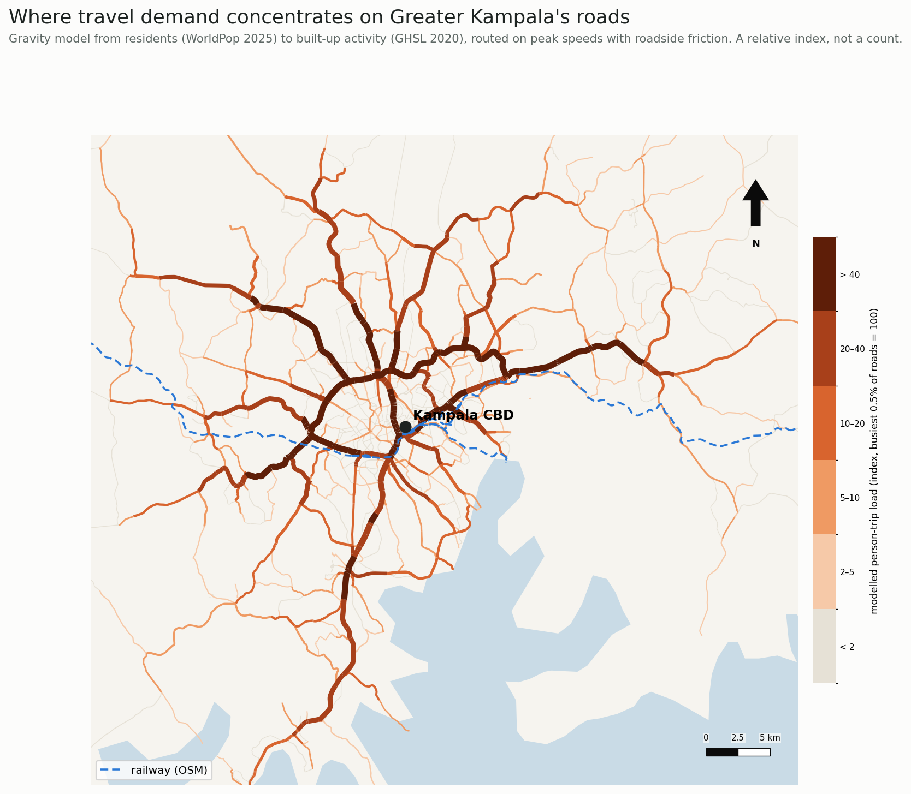{5.6}

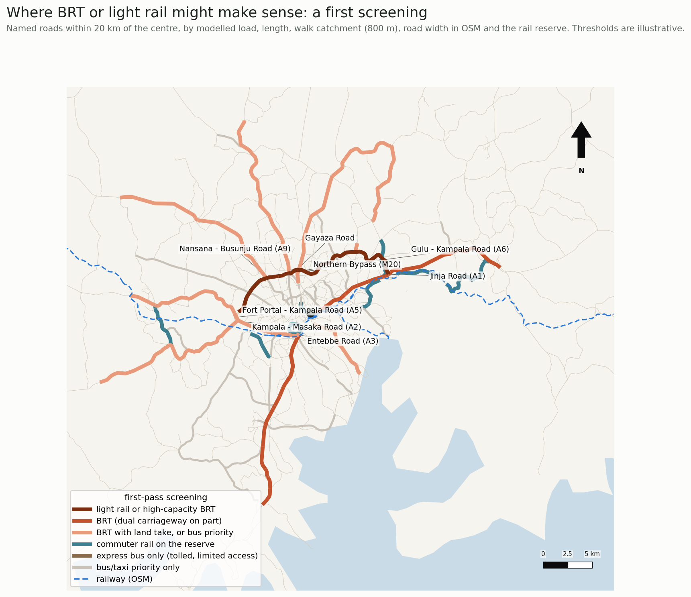{5.6}

## 4.2 Land use: rules and machine learning

Each 250 m cell is described by its buildings: buildings per hectare, median and mean footprint, ground coverage, share under 40 m², and the spread of sizes. A rule-based classification separates seven classes:

- wetland and water;
- commercial and industrial;
- institutional;
- dense small-plot settlement (≥ 35 buildings per ha, median footprint < 70 m²);
- planned or larger-plot residential;
- peri-urban;
- rural.

"Dense small-plot" describes the form typical of unplanned, informal settlement; it is not a tenure classification.

The rules are refined with a random forest (400 trees, balanced class weights). Its features combine building form with imagery measures from Esri World Imagery at about 4.8 m pixels:

- mean and spread of red, green and blue;
- brightness;
- an excess-green vegetation index and the share of vegetated pixels;
- the share of red/orange and of bright roofs;
- texture, as the mean image gradient.

Labels are the cells where one OpenStreetMap land-use group covers more than half the cell. Open water (cells labelled water with no buildings) is left out of training and testing: it is trivial to classify and would inflate accuracy. That leaves 10,182 labelled cells.

Accuracy is measured by spatial cross-validation: the city is cut into 2.5 km blocks and whole blocks are held out, so the model is never scored on a neighbour of a training cell. Because the classes are unbalanced, the paper reports balanced accuracy and macro F1 alongside accuracy.

Two feature sets are compared: building form alone, and form with imagery. The model is explained with SHAP values (Lundberg and Lee, 2017), computed with TreeExplainer on 1,500 labelled cells.

The model's predictions replace the rule class where it is at least 60% confident of wetland, commercial/industrial or institutional use, or of residential use where the rules said otherwise. As an unsupervised check, a Gaussian mixture model is fitted to the residential cells, with the number of groups chosen by BIC, and its groups are compared with the rule classes.

## 4.3 Clearance and displacement

Along each candidate's core length, a cross-section is cast every 100 m, 60 m to each side of the centreline. The clear width is the distance to the first building footprint on the left plus that on the right; 2,347 sections are measured. Two cross-sections are assumed:

- 24 m: a median busway or double track with stations, one general lane each way and sidewalks;
- 30 m: the same, with parking and loading.

Buildings whose footprint lies inside each corridor are counted and assigned the land-use class of their cell.

## 4.4 Lines and networks

Transit lines are added to the road network as a separate layer, with three costs:

- in-vehicle time at a commercial speed that includes stops (BRT 22 km/h, light rail 28 km/h);
- a boarding penalty for the wait and walk (5 and 6 minutes);
- one minute to alight.

Transfers between lines pass through road nodes and pay a new boarding penalty. Minibus taxis remain in general traffic.

Since peak speeds are unknown, every scenario is run with road travel times at 1, 1.5, 2 and 3 times the assumed values. Two networks are grown greedily, at each step adding the corridor that gives the largest marginal gain per km:

- **efficiency:** person-minutes saved;
- **equity:** additional floor area reachable within 45 minutes by residents of dense small-plot settlement.

Each network grows to six corridors and is then evaluated at all congestion levels, as BRT and as light rail.

## 4.5 Equity

Access for zone *i* is A_i = Σ_j F_j · 1[t_ij ≤ 45 min], the floor area F_j reachable within 45 minutes. A cumulative-opportunity measure is used because it is easy to interpret and to compare across groups (Geurs and van Wee, 2004).

Access is the built-up floor area reachable within 45 minutes door to door. Gains are reported:

- by the land-use class residents live in;
- by distance from the centre;
- for the 40% of residents with the least access today;
- as the shift in the population-weighted Lorenz curve and Gini coefficient of access.

## 4.6 Land-use uncertainty

The classifier's probabilities are carried through the analysis. In each of 500 draws, every cell's class is sampled from the random forest's probabilities. Residential draws are split by building form, as in the rules, and farm or forest draws become rural.

For each draw, three things are recomputed:

- the buildings inside each corridor by land use;
- the share of residents in each class;
- the efficiency network's access gain by class.

The results are reported as the final classification with 5–95% ranges.

## 4.7 Appraisal

Benefits are travel-time savings only. Operating costs, emissions and safety are left out, so the benefits are conservative. Costs are capital per km, resettlement per displaced building, and operation and maintenance. Table 2 gives the ranges, each drawn from a triangular distribution 2,000 times. The appraisal uses a 12% discount rate, four years of construction and 25 years of operation.

Table: Table 2. Appraisal inputs (low, central, high).

| Input | Range | Basis |
|---|---|---|
| BRT capital (US$ M/km) | 5, 10, 20 | ITDP (2017); Dar es Salaam DART |
| Light rail capital (US$ M/km) | 15, 35, 60 | Addis Ababa LRT; Flyvbjerg et al. (2008) |
| Resettlement (US$ k per building) | 10, 30, 60 | Ugandan resettlement action plans |
| O&M (% of capital a year) | BRT 3, 5, 8; LRT 3, 4, 6 | Industry ranges |
| Public-transport trips per resident a day | 0.5, 0.8, 1.2 | Kampala travel surveys |
| Value of time (US$ per hour) | 0.4, 0.8, 1.5 | 30–60% of the wage rate |
| Growth of trips (% a year) | 2, 4, 6 | Population growth |

# 5. Results

## 5.1 Land-use patterns

On the rule-based classification refined by the model:

- 54% of residents live in planned or larger-plot areas;
- 19% in peri-urban areas;
- 15% in dense small-plot settlement, concentrated in a belt around the centre;
- 6% in rural cells and 5% in wetland or water cells (@S2).

With building form and imagery, the random forest reaches 84% accuracy under spatial cross-validation, with a balanced accuracy of 0.59 and a macro F1 of 0.61 (Table 5; @M1). It classifies residential land reliably (F1 0.93), farm and forest well (0.76), and wetland and commercial land moderately (0.72 and 0.62). It fails on institutional land, which has only 41 training cells.

Adding imagery to building form raises accuracy from 76% to 84% and macro F1 from 0.52 to 0.61. Most of the gain is for wetland (F1 0.54 to 0.72) and commercial land (0.46 to 0.62).

SHAP attributes 48% of the model's decisions to building form and 52% to imagery. The single most influential features are resident density, image texture (mean gradient), building coverage and building density. Texture distinguishes tightly packed roofs from open and vegetated ground.

Table: Table 5. Spatial cross-validation of the land-use classifier (open water excluded; 10,182 cells).

| Features | Accuracy | Balanced accuracy | Macro F1 | F1 residential | F1 wetland | F1 commercial |
|---|---|---|---|---|---|---|
| Building form (7) | 0.76 | 0.50 | 0.52 | 0.92 | 0.54 | 0.46 |
| Form and imagery (18) | 0.84 | 0.59 | 0.61 | 0.93 | 0.72 | 0.62 |
 The Gaussian mixture separates dense small-plot settlement as its own group (60% of one group), independently of the rules. The model changed the class of 4,779 cells, home to about 350,000 residents, mainly between wetland and residential at the settlement edge.

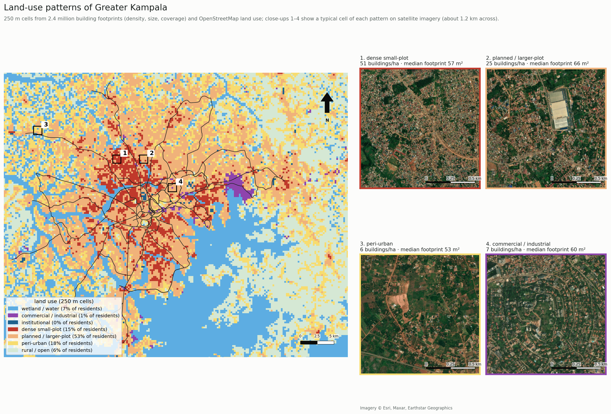{6.3}

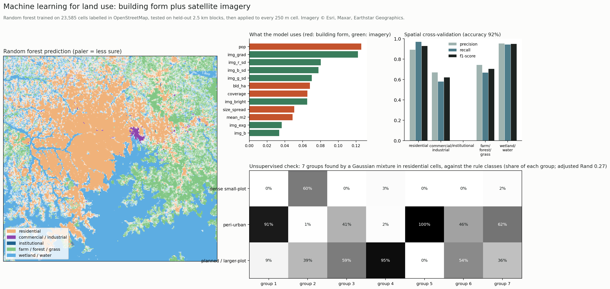{6.3}

## 5.2 Room for rapid transit

Most candidate corridors have room for a 24 m corridor along nearly their whole core length (Table 3; @C1).

- **Northern Bypass:** the median clear width is over 100 m, and only 20 buildings stand inside a 24 m corridor over 39 km.
- **Main radials (Jinja, Masaka, Entebbe and Hoima/Nansana roads):** 10–14 buildings per km would be displaced. Most are in planned areas, but 33–88 per corridor stand in dense small-plot settlement.
- **Bwaise on Bombo Road:** 38 per km, of which 143 of 210 are in dense small-plot settlement.
- **Kireka Road:** 95 per km, of which 268 are in dense small-plot settlement and 79 in wetland.

@C2 shows the pinch points at street level on satellite imagery.

Table: Table 3. Clearance along the main candidates (24 m corridor).

| Corridor | km | Median clear width (m) | Narrowest 10% (m) | Buildings inside | Per km |
|---|---|---|---|---|---|
| Northern Bypass (M20) | 38.6 | 104 | 70 | 20 | 0.5 |
| Jinja Road (A1) | 25.5 | 82 | 33 | 295 | 11.6 |
| Masaka Road (A2) | 25.4 | 73 | 36 | 262 | 10.3 |
| Entebbe Road (A3) | 23.7 | 68 | 39 | 303 | 12.8 |
| Hoima / Nansana Road (A9) | 18.4 | 74 | 31 | 248 | 13.5 |
| Gayaza Road | 21.1 | 65 | 32 | 345 | 16.4 |
| Gulu / Bombo Road (A6) | 12.4 | 79 | 35 | 220 | 17.7 |
| Bombo Road, Bwaise | 5.6 | 51 | 29 | 210 | 37.5 |
| Mbogo Road | 9.6 | 70 | 27 | 384 | 40.0 |

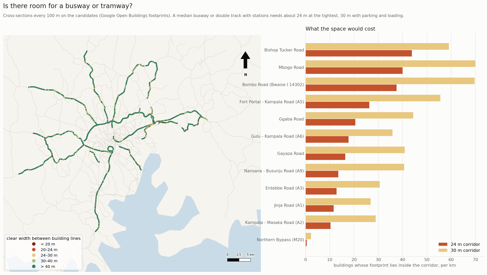{6.3}

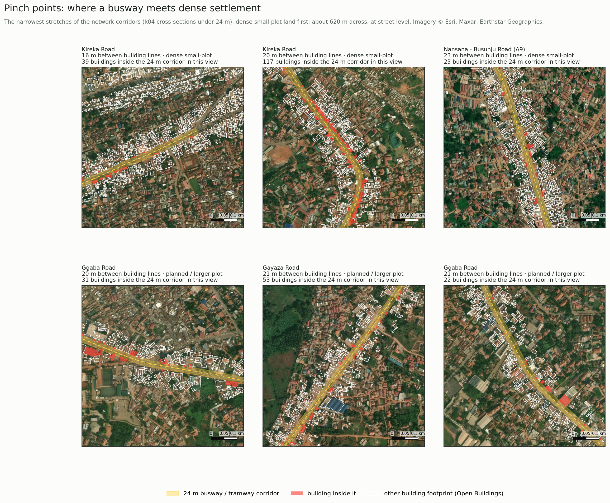{6.3}

## 5.3 Lines alone

At the assumed road speeds no line saves time, because a busway at 22 km/h is no faster than minibus taxis at the assumed speeds. When roads run at half the assumed speed, each radial saves 1.7–2.5% of all modelled trip time as BRT (@B1). Entebbe Road saves the most (2.5%), followed by Nansana–Busunju (2.0%), Masaka (1.9%), Gayaza (1.7%) and Jinja (1.7%). Light rail on the same alignment saves 10–25% more, not enough to change the ranking.

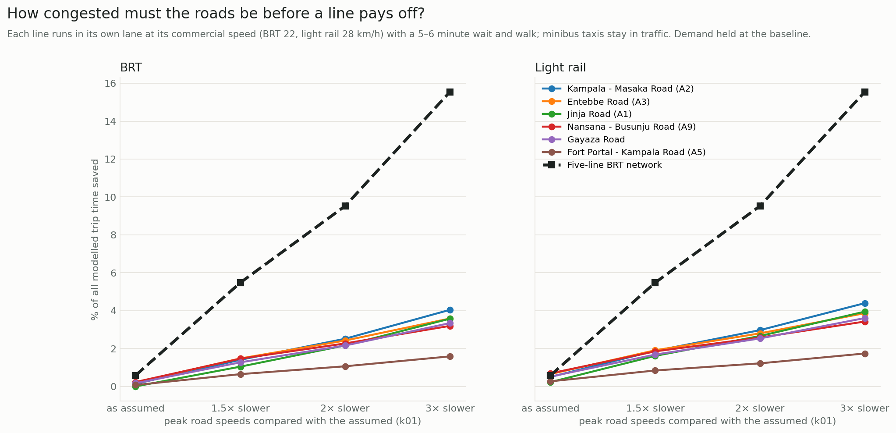{6.3}

## 5.4 Networks

The **efficiency network** adds, in order: Bombo Road at Bwaise, Hoima/Nansana, Entebbe, Ggaba, Masaka and Gayaza roads, 102 km in all (@N1). As BRT at central congestion it saves 9.7% of all trip time, four times the best single line, because riders combine lines. It raises the floor area reachable within 45 minutes by 17% on average.

The **equity network** chooses the same corridors except Kireka Road in place of Entebbe Road, 82 km in all, and saves 7.3%. The two objectives largely coincide because Kampala's dense small-plot settlement lines its busiest radials.

The Northern Bypass is not chosen by either: at 40 km/h its general lanes already outrun a busway.

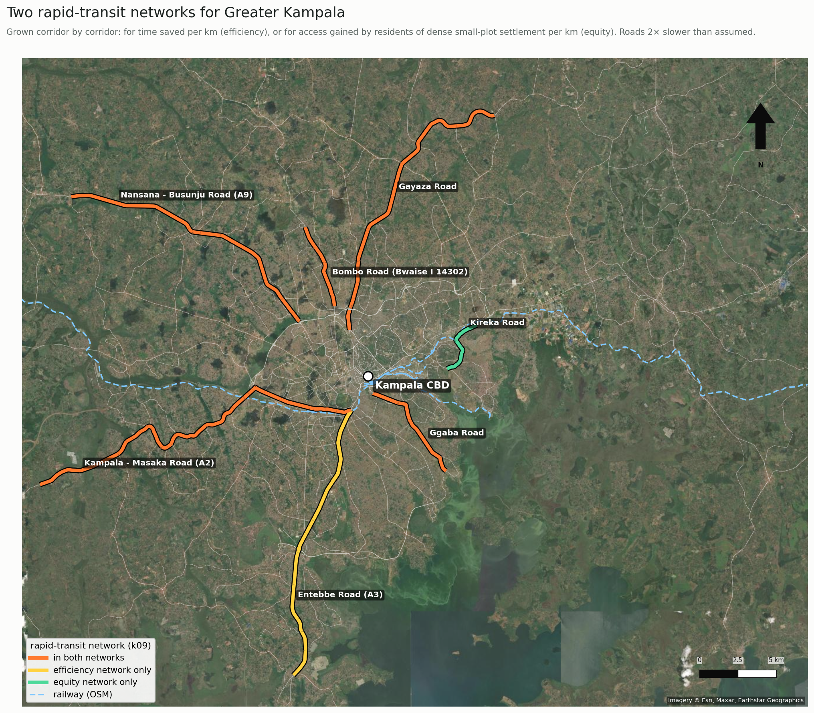{6.3}

## 5.5 Who gains

With the efficiency BRT network at central congestion, residents of dense small-plot settlement gain the most reachable floor area (+19%; @E1, @E2). Planned areas gain 18%, peri-urban 14% and rural 11%.

By distance, homes 10–15 km from the centre gain most (+25%) and homes beyond 20 km only 5%. The Gini coefficient of access does not fall; it rises slightly from 0.470 to 0.477. The network helps the dense core and the radials, while the fringe, where growth is fastest, is left out unless the lines extend to it.

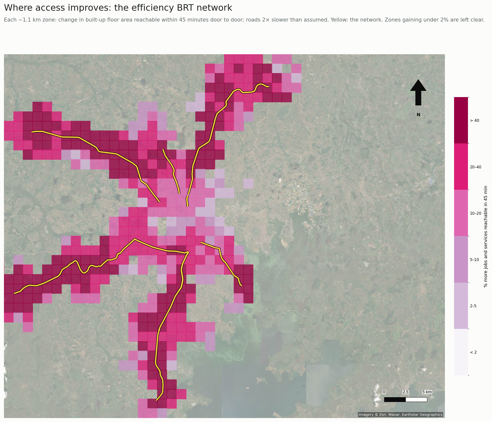{6.0}

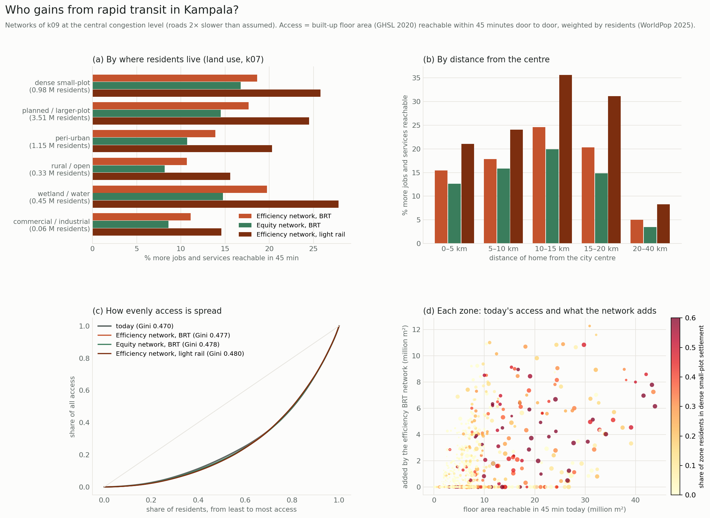{6.3}

## 5.6 Would it pay?

At central congestion the efficiency BRT network has a benefit–cost ratio of 1.33 (5–95% range 0.65–2.57), above one in 74% of draws (Table 4; @A1). Its capital cost, including about 1,500 displaced buildings, is about US$ 1.1 billion at central values. At 1.5 times the assumed travel times it does not pay (0.48); at three times it pays comfortably (3.3).

The best single lines (Entebbe, Nansana–Busunju) have similar ratios to the network (about 1.5) at much lower cost. They are natural first phases.

Light rail on the network costs about US$ 3.6 billion. It pays only if roads are three times slower than assumed (benefit–cost ratio 1.1), and then in only 66% of draws.

Table: Table 4. Benefit–cost ratios (central, 5–95%) and probability of exceeding one.

| Option | Roads 1.5× slower | Roads 2× slower | Roads 3× slower | P(BCR > 1) at 2× |
|---|---|---|---|---|
| Efficiency network, BRT | 0.48 | 1.33 (0.65–2.57) | 3.26 | 74% |
| Equity network, BRT | 0.42 | 1.21 (0.60–2.31) | 3.04 | 67% |
| Efficiency network, light rail | 0.23 | 0.50 (0.27–1.08) | 1.11 | 7% |
| Entebbe Road alone, BRT | 0.59 | 1.47 (0.72–2.84) | 3.43 | 81% |
| Nansana–Busunju Road alone, BRT | 0.58 | 1.54 (0.76–2.97) | 3.58 | 84% |

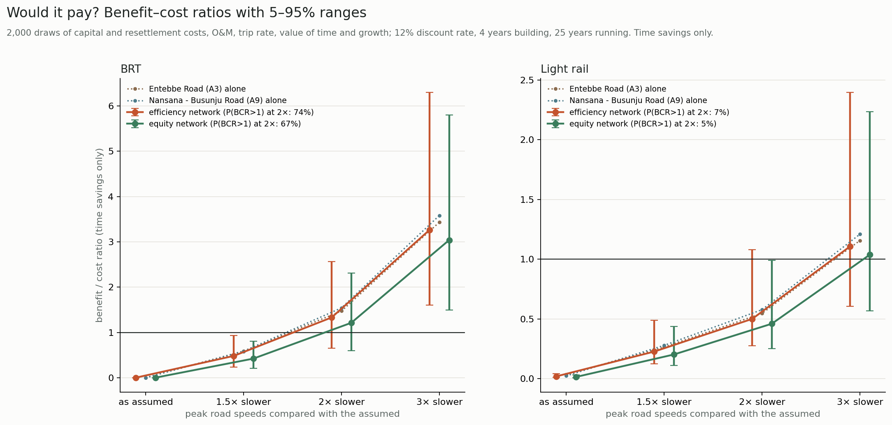{6.3}

## 5.7 How sure are the land-use results?

The results that matter most for the study are robust to land-use uncertainty (@U1):

- **Dense small-plot settlement** holds 15% of residents (5–95% range 14.6–15.1%). Its access gain under the efficiency network is +18.6% (18.5–18.8%).
- **Displacement:** the network's 24 m corridors contain 432 buildings in dense small-plot settlement (406–436). Kireka Road has the widest range, 268 (214–333), because it borders wetland.
- **What is uncertain** is the split at the city's edge between peri-urban, rural and wetland cells. Their share of residents moves by several points between draws. Results for those classes should be read with that range in mind.

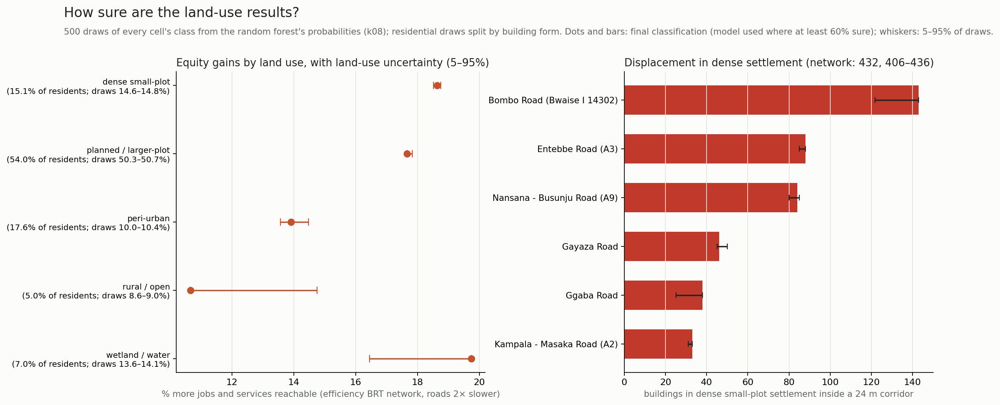{6.3}

# 6. Discussion

## 6.1 Congestion decides; measure it

The case for rapid transit in Kampala rests on one number the city does not have: how slow its arterials are at peak. Below about 1.8 times the assumed travel times, no option pays; above about 2 times, a BRT network does. Rather than assume that number, the paper locates the threshold. That turns an unanswerable appraisal question into a cheap empirical one. A few weeks of GPS traces from minibus or ride-hailing fleets would settle it.

## 6.2 Networks, not lines; BRT, not light rail

The network roughly triples to quadruples what its lines save alone, because travellers transfer between them. Appraising corridors one at a time, as feasibility studies usually do, understates the case. Light rail adds 10–25% to the time saved at three to four times the cost. At Kampala's demand and incomes, BRT is the technology to plan for. Light rail becomes worth considering only on the alignments where a BRT later reaches capacity.

## 6.3 The roadside decides where it fits, and who pays

Space is less binding than often assumed. The main radials offer a 24 m corridor along almost their whole length at a cost of 10–14 buildings per km, mostly in planned areas. The pinch points are few, known and mapped: Bwaise, Kireka, Mbogo Road and short urban stretches. There, the buildings in the way stand mainly in dense small-plot settlement and wetland, where residents are least able to absorb displacement. Footprint-based clearance lets these burdens be counted, and alternatives such as kerbside lanes, one-way pairs or elevated sections be considered, before design rather than after.

## 6.4 Equity: help for the dense core, not the fringe

Residents of dense small-plot settlement gain most in relative terms, but access as a whole does not become more equal. The greatest unmet need is at the fringe beyond 20 km, where the city is growing fastest. Trunk lines reach the fringe only if they extend there. Feeder services, run by the minibus taxi industry, could carry the trunk lines' benefits to the fringe. Designing for equity changes the network only at the margin in Kampala, because the busiest corridors already serve the densest settlement.

## 6.5 Phasing, paratransit and resettlement

**Phasing.** The appraisal suggests a phased programme. Entebbe Road and Hoima/Nansana Road reach benefit–cost ratios of about 1.5 on their own at central congestion, cost a few hundred million dollars each, and displace mostly buildings in planned areas. Built first, they would show whether Kampala's congestion lies above the threshold, at modest risk. The network's other corridors can follow once the first lines' ridership and speeds are observed.

**Minibus taxis.** Experience in Lagos, Johannesburg and Dar es Salaam shows that BRT in African cities succeeds or fails on its relationship with the incumbent paratransit industry (Behrens et al., 2016; Rizzo, 2017). In Kampala the efficiency network's gains depend on transfers between lines, and on feeders that bring passengers from the fringe to the trunk lines. Both are natural roles for the minibus taxi industry if it is brought in as an operator rather than displaced.

**Resettlement.** The pinch points concentrate displacement in dense small-plot settlement and wetland, where tenure is often informal. International lending standards require resettlement to restore livelihoods and to cover people without formal title (World Bank, 2017). The footprint counts here are a first estimate of that obligation, by corridor and land use, available before any alignment is drawn. The resettlement unit costs used in the appraisal (US$ 10–60 thousand per building) make displacement a modest share of a BRT network's cost. The social cost of moving roadside traders and residents is larger than its price.

## 6.6 Transferability

Every input is global and openly licensed:

- building footprints;
- OpenStreetMap roads and land use;
- GHSL built-up surface;
- WorldPop population;
- satellite imagery.

The pipeline can therefore be repeated for any city where rapid transit is being considered, even without traffic data or a cadastre. The congestion sweep makes the missing input explicit rather than hiding it in an assumption. The footprint clearance, land-use classification and network design run in minutes on a laptop.

## 6.7 What machine learning adds

The random forest adds land-use labels where OpenStreetMap has none. Imagery raises macro F1 from 0.52 to 0.61, mostly by separating wetland and commercial land from residential. SHAP shows that texture and resident density drive the decisions, and Monte Carlo shows which conclusions survive the classifier's errors. Unsupervised clustering found the dense small-plot pattern on its own, which supports the rule-based classes. Neither replaces ground truth on tenure or income. Together they make a city-wide first map of who lives at the roadside, from data any city can obtain.

# 7. Limitations

- **No speed data.** Speeds are assumptions shaped by roadside friction, so congestion is swept, not measured.
- **Demand is a gravity index, held fixed.** It is not a survey, and no mode shift or induced demand is modelled. Benefits count travel time only.
- **Land-use classes reflect building form and imagery,** not tenure or income. Institutional land is poorly predicted, with few labels.
- **Clear width ignores walls, utilities, drainage and land ownership;** footprints date from 2020–22.
- **Costs are generic ranges,** not Kampala-specific estimates. Paratransit reorganisation, a central issue for BRT in African cities, is outside the model.

# 8. Conclusion

Measured from space, Kampala's roads have more room for rapid transit than their crowded frontages suggest. The main radials could host a busway at the cost of roughly a dozen buildings per km, and a 100 km BRT network would pay if the roads are at least about twice as slow at peak as assumed here. The pinch points, where a corridor would cut through dense small-plot settlement and wetland, are few and can now be mapped before a line is drawn.

Light rail does not pay at Kampala's demand. Lines should be appraised as networks. Equity requires reaching the fringe, not only the core. The method rests on building footprints, satellite imagery and open data, so any city that lacks traffic data and a cadastre can apply it.

# Data and code availability

All code, derived tables and figures are at https://github.com/gavacharles/uganda-trade-corridors (folder kampala-transit).

# References

Barrington-Leigh, C., Millard-Ball, A., 2017. The world's user-generated road map is more than 80% complete. PLOS ONE 12(8), e0180698.

Behrens, R., McCormick, D., Mfinanga, D. (Eds.), 2016. Paratransit in African Cities: Operations, Regulation and Reform. Routledge, London.

Cervero, R., 2013. Bus Rapid Transit (BRT): An Efficient and Competitive Mode of Public Transport. IURD Working Paper 2013-01, University of California, Berkeley.

Deng, T., Nelson, J.D., 2011. Recent developments in bus rapid transit: a review of the literature. Transport Reviews 31(1), 69–96.

Flyvbjerg, B., Bruzelius, N., van Wee, B., 2008. Comparison of capital costs per route-kilometre in urban rail. European Journal of Transport and Infrastructure Research 8(1), 17–30.

Gava, C., 2026. Highways that became high streets: roadside settlement, controls and the cost of delay on Uganda's five trade corridors. Working paper.

Geurs, K.T., van Wee, B., 2004. Accessibility evaluation of land-use and transport strategies: review and research directions. Journal of Transport Geography 12(2), 127–140.

Hidalgo, D., Gutiérrez, L., 2013. BRT and BHLS around the world: explosive growth, large positive impacts and many issues outstanding. Research in Transportation Economics 39(1), 8–13.

ITDP, 2017. The BRT Planning Guide, 4th edition. Institute for Transportation and Development Policy, New York.

Kuffer, M., Pfeffer, K., Sliuzas, R., 2016. Slums from space—15 years of slum mapping using remote sensing. Remote Sensing 8(6), 455.

Kumar, A., Zimmerman, S., Arroyo-Arroyo, F., 2021. Myths and Realities of "Informal" Public Transport in Developing Countries: Approaches for Improving the Sector. SSATP, World Bank, Washington, DC.

Lucas, K., 2012. Transport and social exclusion: where are we now? Transport Policy 20, 105–113.

Martens, K., 2017. Transport Justice: Designing Fair Transportation Systems. Routledge, New York.

Lundberg, S.M., Lee, S.-I., 2017. A unified approach to interpreting model predictions. Advances in Neural Information Processing Systems 30, 4765–4774.

Lempert, R.J., Popper, S.W., Bankes, S.C., 2003. Shaping the Next One Hundred Years: New Methods for Quantitative, Long-Term Policy Analysis. RAND, Santa Monica.

Marchau, V.A.W.J., Walker, W.E., Bloemen, P.J.T.M., Popper, S.W. (Eds.), 2019. Decision Making under Deep Uncertainty: From Theory to Practice. Springer, Cham.

Pereira, R.H.M., Schwanen, T., Banister, D., 2017. Distributive justice and equity in transportation. Transport Reviews 37(2), 170–191.

Pesaresi, M., Politis, P., 2023. GHS-BUILT-S R2023A: GHS built-up surface grid, derived from Sentinel-2 composite and Landsat, multitemporal (1975–2030). European Commission, Joint Research Centre.

Rizzo, M., 2017. Taken for a Ride: Grounding Neoliberalism, Precarious Labour, and Public Transport in an African Metropolis. Oxford University Press, Oxford.

Sirko, W., Kashubin, S., Ritter, M., et al., 2021. Continental-scale building detection from high resolution satellite imagery. arXiv:2107.12283.

Tatem, A.J., 2017. WorldPop, open data for spatial demography. Scientific Data 4, 170004.

Venter, C., Mahendra, A., Hidalgo, D., 2019. From Mobility to Access for All: Expanding Urban Transportation Choices in the Global South. World Resources Institute, Washington, DC.

World Bank, 2017. The World Bank Environmental and Social Framework (ESS5: Land Acquisition, Restrictions on Land Use and Involuntary Resettlement). World Bank, Washington, DC.

Wurm, M., Stark, T., Zhu, X.X., Weigand, M., Taubenböck, H., 2019. Semantic segmentation of slums in satellite images using transfer learning on fully convolutional neural networks. ISPRS Journal of Photogrammetry and Remote Sensing 150, 59–69.
