title: Highways that became high streets
subtitle: Roadside settlement, controls and the cost of delay on Uganda's five trade corridors
author: Charles Gava
affil: [Affiliation]
email: gavacharles85@gmail.com

# Abstract

Uganda's trade corridors carry the country's imports, exports and transit freight, yet for most of their length they also serve as the main street of the villages and trading centres built along them. This paper measures what that dual role costs. Every national route longer than 100 km that leaves Kampala is divided into 500 m pieces, giving 3,371 pieces over 1,686 km on the roads to Malaba, Elegu, Katuna, Hoima and Bwera. Each piece is described from open data: 1.54 million building footprints, OpenStreetMap junctions and controls, elevation, rainfall and built-up land from 2000 to 2023. A transparent travel-time model for a car and a loaded truck converts these causes into minutes. It is run 1,000 times over the ranges of every assumption, and each cause is switched off in turn to obtain its contribution. The model reproduces independent routing estimates within 1–7% on three of four roads. Roadside settlement now makes up 56–74% of each corridor's length and open road only 18–36%. Built-up land within 300 m of the road grew by 27–68% between 2000 and 2020, and building counts rose a further 22–48% between 2016 and 2023. In light traffic a loaded truck loses 59–161 minutes per trip against open road. Roadside activity is the largest steady cause for cars on every road. For trucks the largest cause depends on the road, from weighbridges and police posts to hills, and even the leading cause comes first in only 35–61% of draws. Roadside friction burns an extra 29–75 litres of diesel per loaded truck trip, about 138 kt of CO₂ and US$70 million of fuel a year, and costs about US$41 million a year in truck time. Settlements hold 65–79% of the road-safety exposure. Weigh-in-motion screening and an end to stops at police posts save the most time per shilling spent. Service roads and bypasses would only recover time already lost to the roadside, and would have to be planned with the land use that produces it.

**Keywords:** trade corridors; roadside friction; ribbon development; travel-time model; Uganda; open data

# 1. Introduction

Land transport costs remain one of the largest barriers to trade for landlocked countries in East Africa. Uganda's imports and exports reach the sea through Kenya and Tanzania, and its roads carry transit freight to South Sudan, Rwanda and the eastern Democratic Republic of Congo. Studies of these corridors have long found that the price of moving a container inland is driven less by the vehicle-operating cost of the road than by time lost at borders, weighbridges, checkpoints and in ports, and by the market structure of trucking (Teravaninthorn and Raballand, 2009; Arvis et al., 2010). The Northern Corridor Transit and Transport Coordination Authority (NCTTCA) now reports truck transit times by GPS and by electronic cargo tracking, and these show trucks spending most of a trip stopped rather than driving (NCTTCA, 2026a).

A less studied cost lies in the moving time itself. Between the towns, Uganda's paved national roads have become the high streets of continuous roadside settlement: trading centres, markets, taxi stages, fuel stations and houses facing the road, with minor roads joining at short intervals. Traffic engineers call the result side friction. Pedestrians, parked and stopping vehicles, motorcycle taxis and turning traffic lower the speed and capacity of a road whose design assumes open country (Bang, 1998; Chiguma, 2007; Pal and Roy, 2016). For a loaded truck, side friction compounds with speed humps placed to protect the people who live there, with police checks, weighbridges and hills. Each slow-down costs time, and each re-acceleration costs fuel. The same mix that slows traffic also places people beside fast heavy vehicles, which is where much of the region's road death toll arises (WHO, 2023).

Three things make the question pressing. First, roadside building is still spreading: new footprints concentrate along paved roads (Storeygard, 2016; Jedwab and Storeygard, 2022), so friction grows with time even where the pavement does not change. Second, the remedies on offer pull in different directions. Bypasses, service roads, weigh-in-motion and checkpoint reform each target a different cause, and their value depends on which cause dominates where. Third, there is almost no traffic data with which to observe the roads directly. Commercial speed feeds carry licensing restrictions, and the public GPS traces on these roads are few and old.

This paper therefore does not watch traffic. It measures the causes of delay from open data, estimates what each costs in time, fuel, money and risk, checks the estimates against published trip times, and ranks the stretches and remedies where change would matter most. It asks three questions:

- Where on each corridor is travel slowed, and by which causes?
- How much has the roadside been built up since 2000, and where?
- Which stretches and which fixes would save the most time, fuel and risk?

The contribution is partly empirical: a cause-by-cause account of delay along all five of Uganda's main corridors, with uncertainty attached to every number. It is also partly methodological. The pipeline uses only open, global datasets and a model whose assumptions are listed in one place, so it can be rerun elsewhere. A companion paper applies it to 54 roads leaving twelve hubs in East and Southern Africa.

The rest of the paper is organised as follows. Section 2 reviews the literature on corridor costs, side friction, roadside growth and exposure. Section 3 describes the corridors, data and model. Section 4 reports results, Section 5 discusses them, Section 6 sets out the limitations and Section 7 concludes.

# 2. Literature

## 2.1 Corridor costs in East Africa

The World Bank's review of African corridor costs found transport prices in East and Central Africa among the highest in the world. It attributed this mainly to low truck use, slow border and port procedures and the regulation of trucking rather than to road condition (Teravaninthorn and Raballand, 2009). Arvis et al. (2010) generalised the point for landlocked countries: unreliability, rather than average time, forces shippers to hold inventory and so dominates logistics costs. Corridor management programmes have since concentrated on one-stop border posts, electronic cargo tracking and weighbridge reform (Kunaka and Carruthers, 2014). Observatory data show that these reforms shortened transit across the Northern Corridor. They also show that rest stops, border procedures and weighbridges still account for most of the time a truck spends stopped (NCTTCA, 2026a). What lies between the control points, in the hours a truck is moving, has received far less attention.

## 2.2 Side friction

Side friction is well established in highway capacity analysis for South and South-East Asia. The Indonesian Highway Capacity Manual classes roads by side-friction level from counts of pedestrians, stopping vehicles, slow vehicles and entering traffic, and reduces free-flow speed and capacity accordingly (Bang, 1998). Chiguma (2007) measured speed losses from roadside activity on urban links in Dar es Salaam. Pal and Roy (2016) found large speed reductions on rural Indian highways passing through roadside settlements. The Highway Capacity Manual handles the same effect through access-point density and lateral clearance (TRB, 2016). The HDM-4 road user effects model represents it with a side-friction factor on desired speed (Bennett and Greenwood, 2001). These studies observe traffic at a few sites; none estimates side friction continuously along whole corridors, or attributes a corridor's delay among friction, controls and terrain.

## 2.3 Roadside growth

Paved roads attract settlement. Across sub-Saharan Africa, lower transport costs raised city growth (Storeygard, 2016), and road investment since 1960 has concentrated population and activity along the improved links (Jedwab and Storeygard, 2022). Global built-up layers now let this growth be measured directly. The Global Human Settlement Layer gives built-up surface from 1975 at 100 m (Pesaresi and Politis, 2023). Google's Open Buildings gives individual footprints, and its temporal product gives yearly estimates since 2016 (Sirko et al., 2021). Ribbon development of this kind is usually discussed as a planning or safety problem. Its cost to the through traffic for which the road was built has rarely been quantified.

## 2.4 Exposure and safety

The power model links crash risk to speed: fatal crashes rise roughly with the fourth power of mean speed (Nilsson, 2004; Elvik, 2009). In low- and middle-income countries most road deaths are pedestrians and riders of two-wheelers, and many occur on inter-urban roads passing through settlements (WHO, 2023). An exposure index combining people beside the road, heavy-vehicle flow and speed therefore indicates where interventions might matter. Without crash records for each location, however, it remains an index rather than a risk.

## 2.5 Fuel and emissions

Stop-and-go driving raises fuel use per kilometre. Each deceleration wastes kinetic energy that the engine must then restore (Barth and Boriboonsomsin, 2008; Demir et al., 2014). For heavy trucks the penalty is large, because mass dominates the energy of acceleration. Road freight is a growing share of transport emissions in Africa (Jaramillo et al., 2022). Estimates of the emissions caused by roadside friction, as distinct from congestion, do not appear to exist for the region.

# 3. Study area, data and methods

## 3.1 Corridors

The corridors are the five national routes leaving Kampala that are longer than 100 km. They were found by the companion paper's search, which follows every numbered motorway, trunk or primary route passing within 8 km of the city centre. Table 1 lists them; Figure @F1 maps them. Four end at a border: Malaba (Kenya), Elegu (South Sudan), Katuna (Rwanda) and Mpondwe/Bwera (DR Congo). The fifth, the A9 to Hoima, serves the Albertine oil region.

Table: Table 1. The five corridors.

| Corridor | Route | Length (km) | Leads to |
|---|---|---|---|
| Kampala → Jinja → Malaba | A1 | 216 | Northern Corridor to Mombasa |
| Kampala → Gulu → Elegu | A6 | 431 | Juba; Gulu logistics hub |
| Kampala → Masaka → Mbarara → Katuna | A2 | 426 | Kigali, Central Corridor |
| Kampala → Hoima | A9 | 194 | Albertine oil region |
| Kampala → Fort Portal → Kasese → Bwera | A5 | 418 | North Kivu, DR Congo |

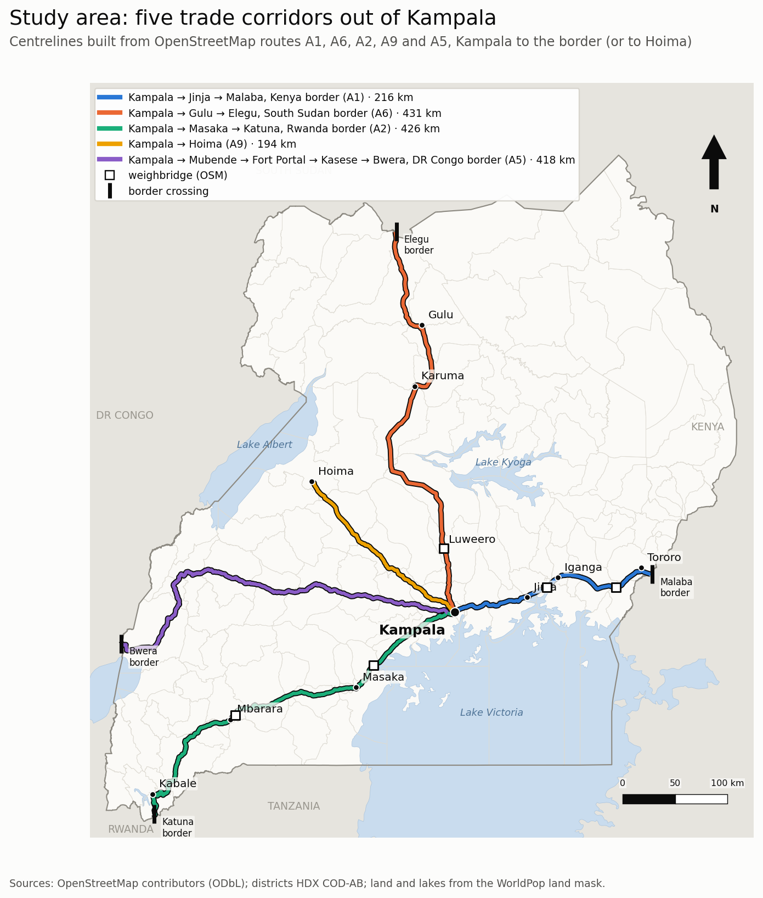{5.6}

## 3.2 Data

All causes are measured from open data (Table 2). The centrelines follow the OpenStreetMap (OSM) route relations in each direction, with nearby main roads bridging gaps in the route tagging; OSM's road network is close to complete at this level (Barrington-Leigh and Millard-Ball, 2017). Buildings are the 1.54 million Google Open Buildings v3 footprints within 1 km of the roads (Sirko et al., 2021). Junctions, signals, crossings, police posts, markets, schools, fuel stations and waterways are taken from OSM. Weighbridges are found by name, because they are rarely tagged consistently. Elevation is the Copernicus GLO-30 surface model, and rainfall is CHIRPS daily data for 2006–2025 (Funk et al., 2015). Built-up land comes from GHSL GHS-BUILT-S for 2000–2020, with JRC's projection to 2030 (Pesaresi and Politis, 2023). The Open Buildings 2.5D Temporal layer gives yearly counts for 2016–2023. Population is WorldPop 2025 (Tatem, 2017).

Published records are used only to check and scale the results, never as inputs to the causes:

- Rome2rio routing estimates and scheduled bus times.
- The NCTTCA Transport Observatory's truck transit times, driver stop reasons and weighbridge times for 2025 and January–June 2026 (NCTTCA, 2026a, 2026b).
- Truck counts by station from the NCTTCA GHG Emissions Baseline (NCTTCA, 2025).
- The Uganda Police list of crash black spots named by traffic officers (Uganda Police Force, 2018).
- A documented flood on the A5.

Table: Table 2. Causes measured for each 500 m piece.

| Group | Measure | Source |
|---|---|---|
| Roadside activity | Buildings within 100 m and 300 m; shops, markets, fuel, schools, stops | Open Buildings v3; OSM |
| Access | Major and minor roads joining the corridor | OSM |
| Point controls | Signals, pedestrian and level crossings, humps, police posts, weighbridges | OSM |
| Design | Dual or single carriageway; curvature | OSM |
| Terrain | Climb each way; average grade | Copernicus GLO-30 |
| Water | Waterway crossings; wetland share | OSM |
| Weather | Days a year with ≥ 10 mm of rain, 2006–2025 | CHIRPS |
| Growth | Built-up land within 300 m, 2000–2020; buildings 2016–2023 | GHSL; Open Buildings Temporal |

Figure @P6 shows the controls that OpenStreetMap records along the corridors. Pedestrian crossings appear on 53 pieces, police posts on 39 and weighbridges on 5. Signals appear on only 5 pieces and humps on 22, far fewer than exist on the ground, which is why humps are assumed in the model (Section 3.4).

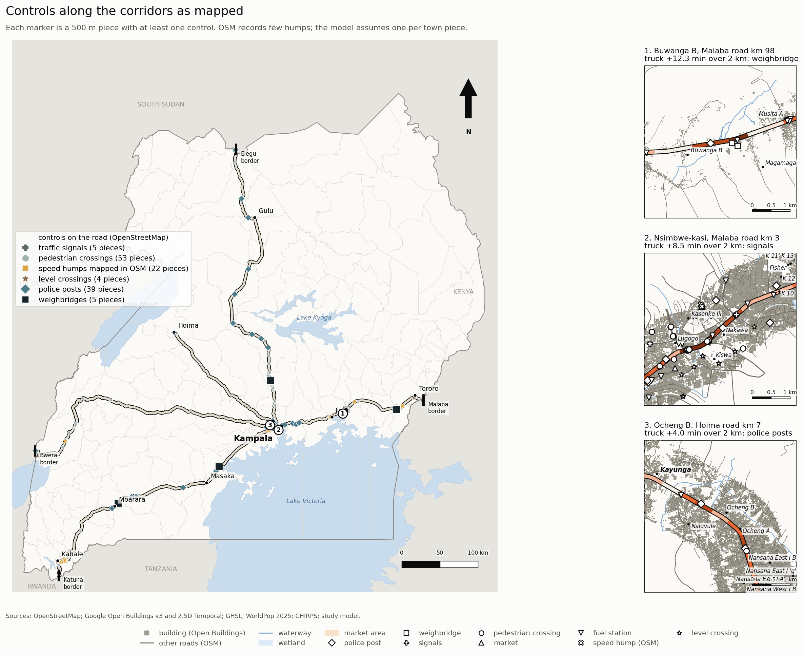{5.6}

## 3.3 Pieces and road types

Each corridor is cut into 500 m pieces, and every measure is attached to the piece it falls in. The pieces are grouped into road types by k-means on standardised roadside measures: buildings within 100 m and 300 m, joining roads, and roadside activity points. The number of types, three, was chosen by silhouette score from three to six. Ordered by building density, the types are *open road*, *roadside settlement* and *town*. The typology is descriptive; the travel-time model uses the measures themselves, not the types, except for the town speed limit and the assumed speed humps.

## 3.4 Travel-time model

For a car and for a loaded heavy goods vehicle, each piece's speed starts at an open-road speed: 90 km/h for a car on a single carriageway, 100 km/h on a dual carriageway and 70 km/h for a truck. Speed is then reduced multiplicatively by:

- **roadside activity**, rising linearly with buildings within 100 m to a maximum loss of 35% at 300 buildings;
- **joining roads**, up to 15% at ten or more junctions per piece;
- a **town speed limit** of 50 km/h in town pieces;
- **curves**, with a speed cap where curvature exceeds 150° per km;
- for trucks, **hills**: speed is capped at the open speed divided by 1 + 0.25 × (grade − 1) on uphill grades above 1%, so the same hill costs time in one direction only.

Fixed delays are then added:

- 30 s per signal, 5 s per pedestrian crossing and 15 s per level crossing;
- 8 s per hump (12 s for a truck), with one hump assumed per town piece because OSM records almost none;
- 10 s per police post for a car and 60 s for a truck;
- 10 minutes for a truck at each weighbridge.

A wet day multiplies speed by 0.90. Every parameter has a range (Table 3).

Table: Table 3. Model assumptions (central value and range drawn in the Monte Carlo).

| Parameter | Central | Range |
|---|---|---|
| Open-road speed, car single / dual (km/h) | 90 / 100 | 80–100 / 90–110 |
| Open-road speed, loaded truck (km/h) | 70 | 60–80 |
| Largest speed loss from roadside activity | 35% | 20–50% |
| Buildings within 100 m at which it is reached | 300 | 200–400 |
| Speed loss at 10+ joining roads | 15% | 5–25% |
| Town speed limit (km/h) | 50 | 40–60 |
| Truck grade coefficient k | 0.25 | 0.15–0.35 |
| Signal delay (s) | 30 | 15–45 |
| Humps per town piece (assumed) | 1 | 0–2 |
| Police-post stop, truck (s) | 60 | 0–300 |
| Weighbridge stop, truck (s) | 600 | 300–1,800 |
| Wet-day speed factor | 0.90 | 0.85–0.95 |

The minutes a cause adds are found by switching it off and rerunning the model. Causes interact, because a speed cap applied after a friction loss may or may not bind. The individual contributions therefore do not sum exactly to the total, and the remainder is reported as overlap. One thousand Monte Carlo draws, each sampling every parameter uniformly within its range, give 5–95% intervals. They also give the share of draws in which each cause is the largest, which we call rank stability. The model describes light traffic, because congestion cannot be measured from these sources.

## 3.5 Extensions

The same pieces and model support six further analyses.

**Hotspots.** The ten worst 2 km stretches on each road are mapped with their causes.

**Scenarios.** The model is rerun with each fix applied:

- weigh-in-motion screening, which removes the weighbridge stop for compliant trucks;
- no stops at police posts;
- bypasses of the two worst towns;
- service roads that remove roadside friction from the worst 20 km or from every settlement.

**Costs.** Minutes become money at US$25 per truck-hour (range 15–40) and US$6 per car-hour (3–10). Truck counts are surveyed on three roads (NCTTCA, 2025) and assumed on the other two (Table 4 notes).

**Reliability.** Every day from 2006 to 2025 is replayed with the rain that fell on each piece. The buffer index is the extra time, beyond the typical trip, needed to arrive on time on 19 days in 20 (FHWA, 2006).

**Safety exposure.** For each piece, exposure is the number of people living within 300 m × trucks per day × (truck speed/50)⁴. A school stretch is flagged where a school, trucks above 50 km/h and no marked crossing within 500 m coincide.

**Fuel and CO₂.** A physical model counts four components on the model's speed profile, through a fixed tank-to-wheel efficiency:

- rolling and air resistance;
- re-acceleration between pieces and after every point event;
- repeated roadside slow-downs;
- idling.

Friction fuel is the difference from the same trip at open-road speed. CO₂ is 2.68 kg per litre of diesel.

Three checks use outside records:

- **Black spots.** Police black spots are located by place name. Their stretches are tested against random stretches near a named place by permutation, on buildings, junctions, truck speed, design and exposure.
- **Transit gap.** Observed truck transit times are compared with modelled driving time.
- **Growth to 2023.** Building counts for 2016–2023 near the road are compared with a 1–2 km control ring.

## 3.6 Validation

Modelled car times are compared with Rome2rio routing estimates and scheduled bus times (Table 4). The model sits within 1–7% of the routing estimates to Gulu, Kabale and Hoima. It is 15% fast to Fort Portal, where pavement condition, which the model omits, is poor on parts of the A5. It is below bus times everywhere, as expected for light traffic without stops. On the Kampala–Jinja section, observed trips of two to three hours far exceed the modelled 91 minutes. That gap is peak congestion at the Kampala end, which the model does not represent.

Table: Table 4. Model against independent trip times (car, minutes).

| Trip | Routing estimate | Bus or observed | Model |
|---|---|---|---|
| Kampala–Gulu (A6) | 286 | 300–495 | 266 |
| Kampala–Kabale (A2) | 345 | 480 | 343 |
| Kampala–Hoima (A9) | 172 | 206 | 164 |
| Kampala–Fort Portal (A5) | 269 | 271 | 228 |
| Kampala–Jinja (A1) | – | 120–180 | 91 |

# 4. Results

## 4.1 What the corridors have become

Roadside settlement is now the normal condition of a Ugandan trade corridor (Figures @P1 and @F2; Table 5). It makes up 56% of the Elegu road and 74% of the Hoima road. Open road, averaging fewer than ten buildings within 100 m per 500 m piece, is 18–36%. Towns are 4–22%; the Malaba road, through Mukono, Lugazi, Jinja, Iganga and Tororo, has the most. Roadside settlements average 90–156 buildings within 100 m per 500 m piece, and towns 338–416. Even in settlements, three to five minor roads join per km.

Table: Table 5. Road types and growth by corridor.

| Corridor | Open road | Roadside settlement | Town | Built-up growth 2000–2020 | Building growth 2016–2023 (trend) |
|---|---|---|---|---|---|
| Malaba (A1) | 21% | 57% | 22% | +27% | +30% |
| Elegu (A6) | 36% | 56% | 8% | +68% | +22% |
| Katuna (A2) | 26% | 63% | 11% | +44% | +40% |
| Hoima (A9) | 18% | 74% | 8% | +57% | +48% |
| Bwera (A5) | 29% | 67% | 4% | +57% | +41% |

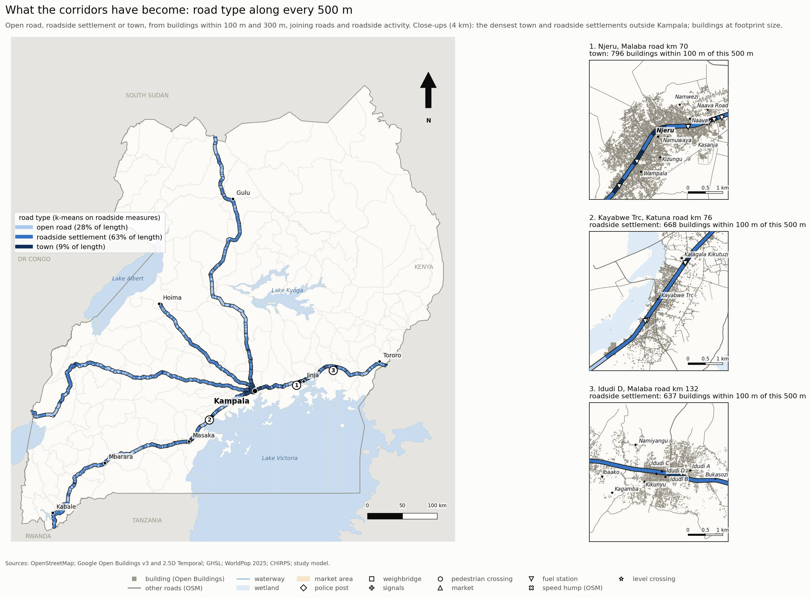{6.3}

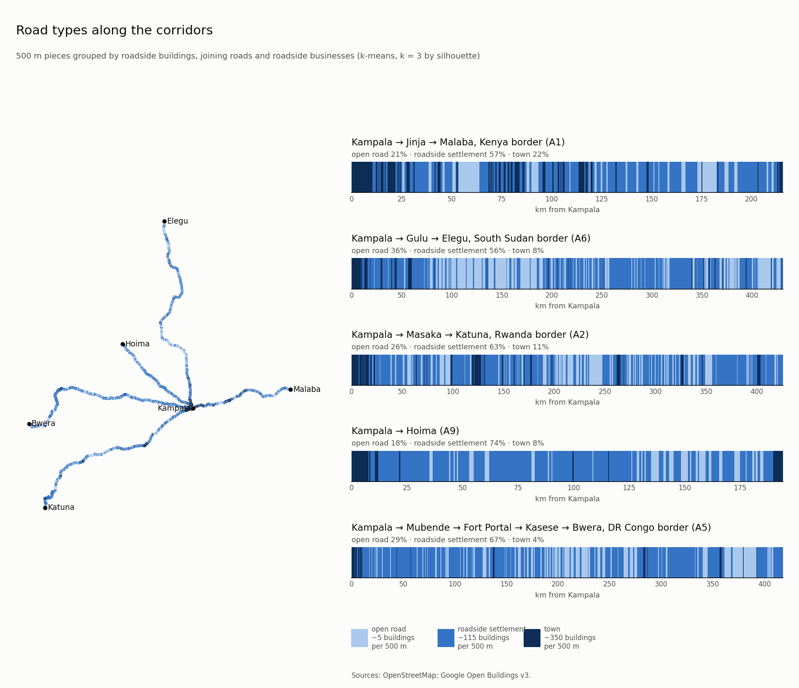{6.3}

Built-up land within 300 m of the road grew by 27% (Malaba) to 68% (Elegu) between 2000 and 2020 (Figures @P2(a) and @F3). Most of the added area lies in roadside settlements between towns, not in the towns themselves: towns grew 13–21%, settlements 45–102%. Open road grew fastest in percentage terms (186–307%) from a tiny base, and this is how new settlements appear. The fastest-growing 5 km on each road are at Baggala on the Malaba road, Kichwabugingo near Karuma on the Elegu road, Kassana on the Katuna road, and Kasangobe and Kalambi on the Hoima and Bwera roads just outside Kampala.

{6.3}

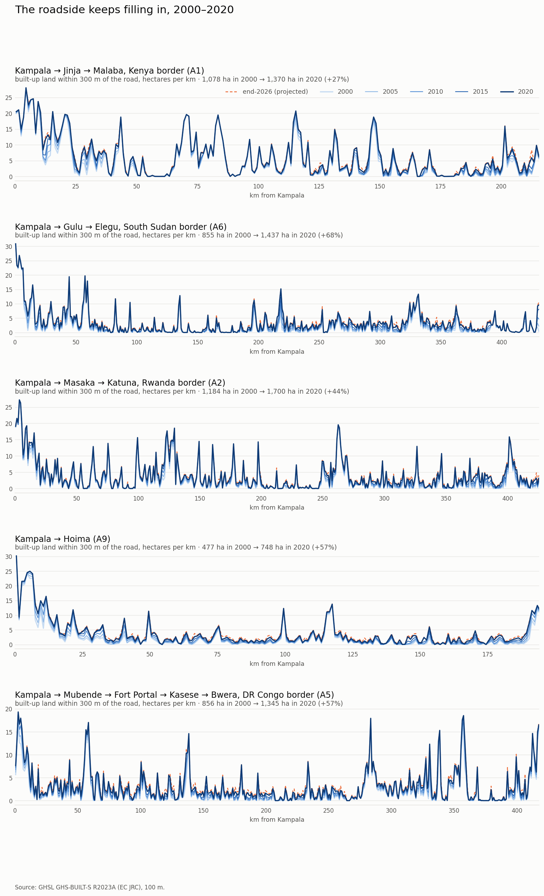{6.3}

The temporal building layer shows the growth continuing (Figures @P2(b) and @F4). Building counts within 300 m rose 22–48% over 2016–2023 by fitted trend, or 2.8–5.8% a year. That is two to four times GHSL's observed rate for 2015–2020, so GHSL's projection to 2026 (+5–10%) understates recent building. Land 1–2 km back grew faster in percentage terms (36–57%) from a lower base. Per km², however, the roadside gained 1.6–2.1 times as many buildings as the control ring: the corridor attracts building in absolute terms, not by drawing it from behind. A step in 2020–22 appears near the road and behind it alike, so part of it may be a change in imagery or model rather than on the ground.

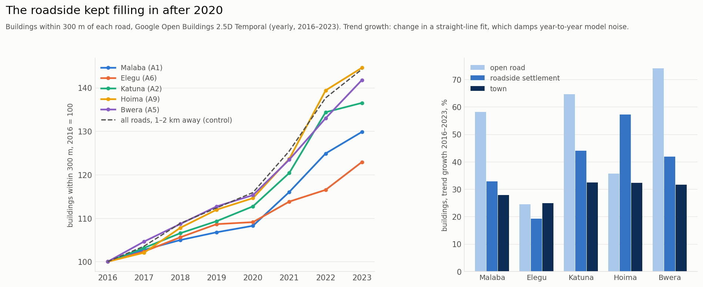{6.3}

## 4.2 Time lost and why

In light traffic on a dry day, a loaded truck loses 59 minutes (Hoima) to 161 minutes (Katuna) per trip against the same road with open-road conditions throughout (Table 6). That is 29–64% more than open-road driving time. Cars lose 34–80 minutes. Per 100 km, the Malaba road is worst for both: 55 truck-minutes and 33 car-minutes per 100 km, against 25–38 truck-minutes on the other four.

Table: Table 6. Minutes added per trip, leaving Kampala (central estimate and 5–95% range).

| Corridor | Truck, open road | Truck, modelled | Truck minutes lost | Car minutes lost | Wet day, truck (extra) |
|---|---|---|---|---|---|
| Malaba (A1) | 185 | 304 | 119 (105–202) | 72 (54–101) | +27 |
| Elegu (A6) | 369 | 476 | 107 (91–190) | 59 (44–89) | +48 |
| Katuna (A2) | 365 | 526 | 161 (143–250) | 80 (58–118) | +53 |
| Hoima (A9) | 167 | 226 | 59 (47–91) | 34 (24–52) | +24 |
| Bwera (A5) | 358 | 482 | 124 (99–181) | 63 (44–97) | +52 |

Figure @F5 breaks the delay into its causes, and Figure @F6 shows how a truck trip builds up cause by cause. For cars, roadside activity is the largest steady cause everywhere: 16–33 minutes per trip, followed by assumed humps, town limits and joining roads. On the Malaba road, signals and crossings at the Kampala end add 10 minutes.

For trucks the picture differs road by road:

- **Bwera and Katuna roads:** hills dominate (43 and 38 minutes). The A5 climbs the Rwenzori foothills and the A2 crosses the Ankole and Kigezi highlands. Roadside activity follows (37 and 35 minutes).
- **Malaba road:** the two weighbridges at Magamaga and Busitema/Namutere (20 minutes), the assumed humps (19), roadside activity (25) and police posts (10) are of similar size.
- **Elegu road:** roadside activity (29), police posts (15), humps (13), hills (13) and the Luwero weighbridge (10).
- **Hoima road:** roadside activity alone (19 minutes) is the largest cause.

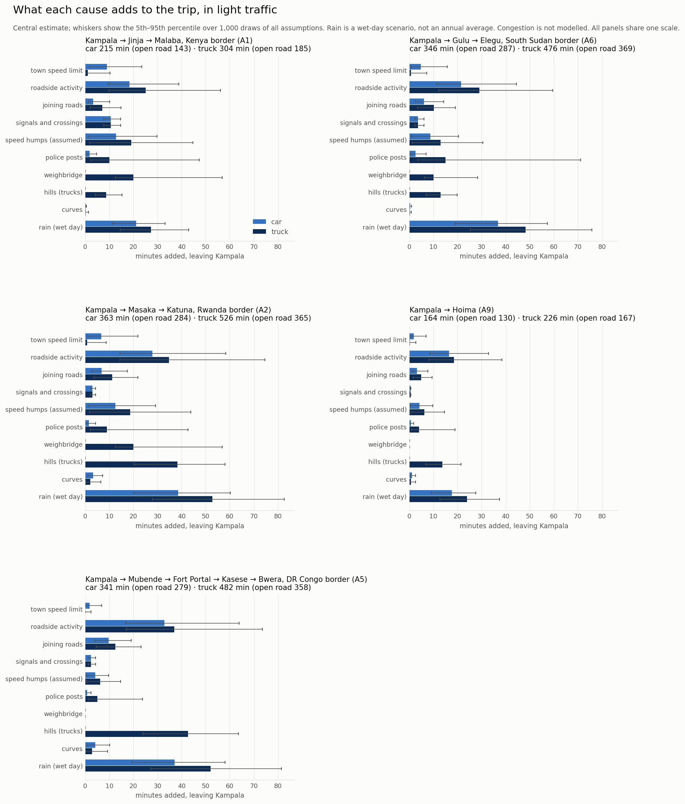{6.3}

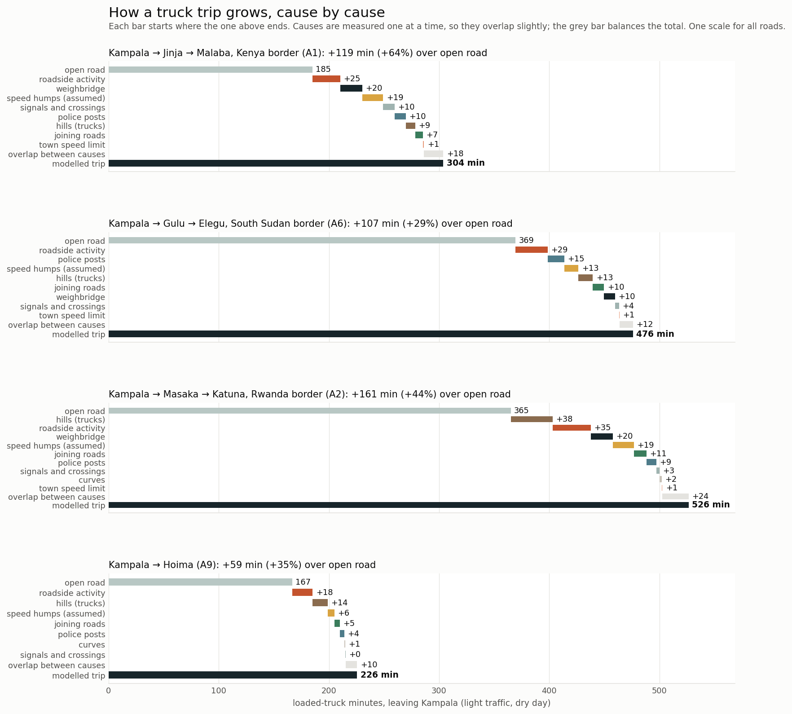{5.8}

Rank stability tempers these rankings (Figure @F7). For cars, roadside activity is the largest cause in 81–100% of draws on four roads and 56% on the Malaba road, where humps and signals compete. For trucks, no ranking is certain:

- hills are first on the Bwera road in 57% of draws and roadside activity in 43%;
- police posts lead on the Elegu road in 56% of draws, because the stop time ranges from 0 to 5 minutes;
- weighbridges lead on the Malaba road in 47%;
- on the Katuna road, where hills add the most minutes at central values, roadside activity is first more often than hills, but in only 35% of draws.

Statements about "the" main cause of truck delay should therefore carry these shares.

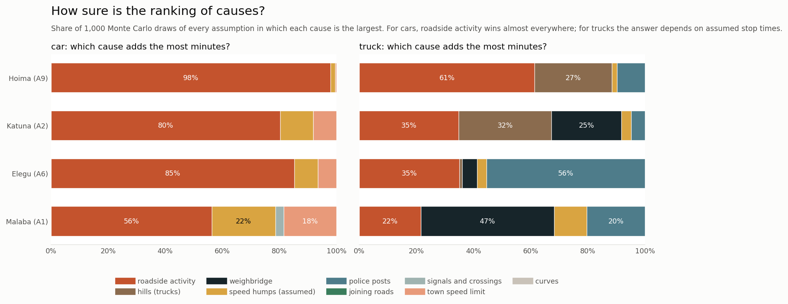{6.3}

## 4.3 Where: the worst stretches

Figure @F8 maps truck minutes lost per km along all five roads, and Figure @F9 shows close-ups of the worst stretches. The single worst 2 km stretches are weighbridges: Buwanga near Magamaga and Namutere on the A1, Magezi near Lukaya and Rwebihuro near Mbarara on the A2, and Kizito near Luwero on the A6. Each costs 10–12 truck-minutes, almost all at the weighbridge itself. Leaving these aside, the worst stretches are town entries close to Kampala:

- Nakawa and Kireka on the A1, where signals, crossings and humps add 5–9 minutes per 2 km;
- Nansana and Ocheng on the A9;
- Buloba on the A5;
- Kitaka on the A2.

The border approach at Bibia on the A6 is another.

Kampala's exits concentrate these problems (Figure @P7). In the first 35 km, all five corridors run through near-continuous building, and minor roads join every few hundred metres. Delay of 1–4 truck-minutes per km clusters at Nansana on the A6 and A9, Kyengera and Kitemu on the A2, and Mukono on the A1. Figure @A1 shows the full analysis sheet for one corridor, the Malaba road: its ten worst stretches, its long profile, three close-ups and their causes. The close-ups show the pattern behind the numbers: continuous roofs on both sides, a fine mesh of minor roads joining the corridor, fuel stations and markets at the junctions, and controls stacked within a few hundred metres.

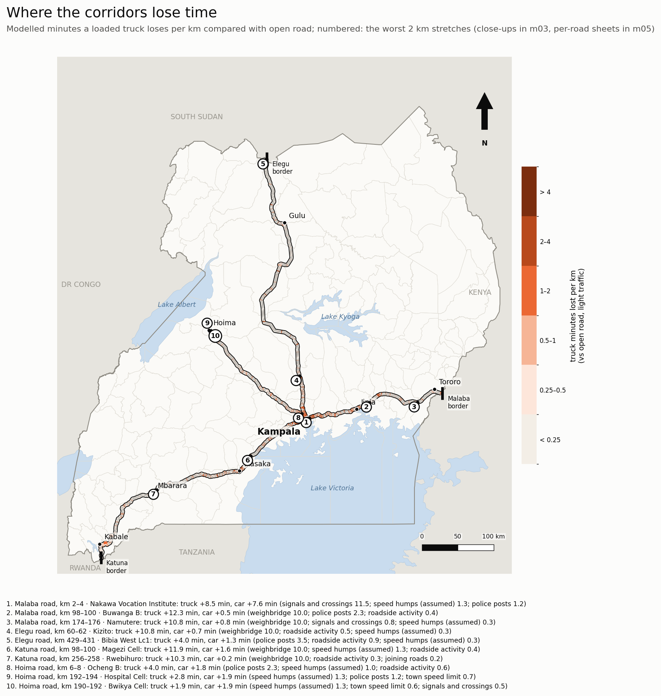{5.6}

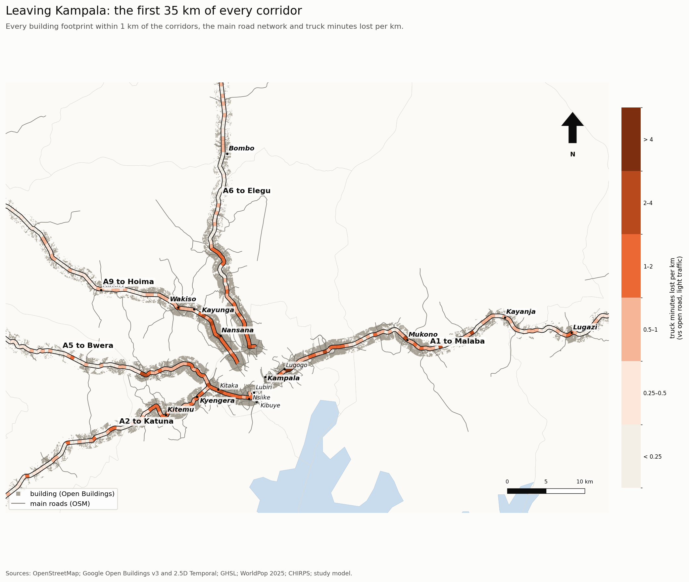{6.3}

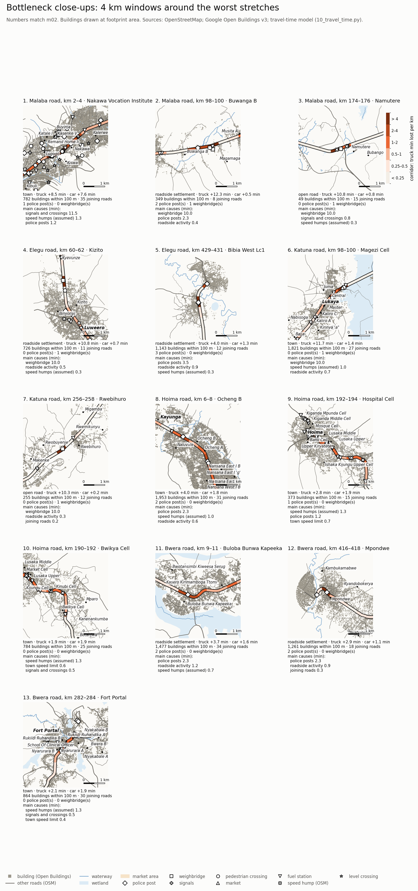{6.3}

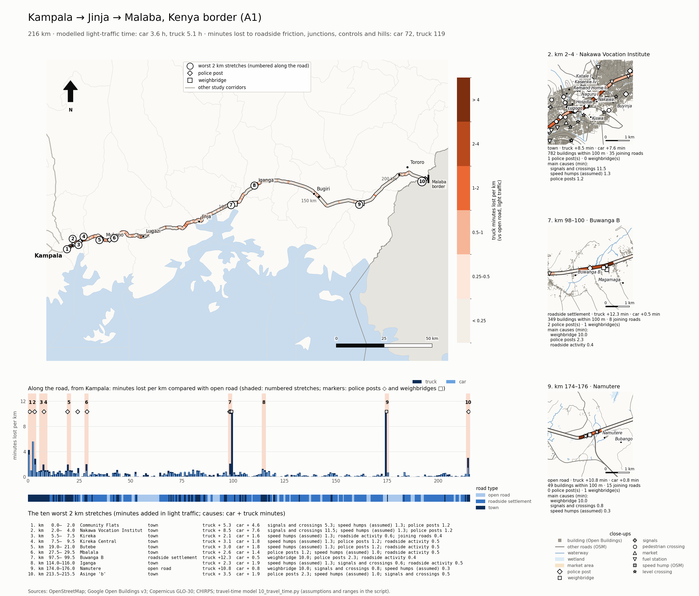{6.3}

## 4.4 Fixes

Table 7 and Figure @F10 report what each fix would save per truck trip.

- **Weigh-in-motion screening** saves 8 minutes on the Elegu road and 16 minutes each on the Malaba and Katuna roads, where it would apply at Luwero, Magamaga and Busitema, and Lukaya and Mbarara.
- **No stops at police posts** saves 4–15 minutes. The Elegu road gains most, but the 5–95% range runs to over an hour because the stop time is so uncertain.
- **Service roads through every roadside settlement** save 10–23 minutes. They would need 124–281 km of new road per corridor, about 0.06–0.08 minutes saved per km built.
- **Service roads on the worst 20 km only** save 3–5 minutes, three times the yield per km.
- **Bypassing the two worst towns** saves 0–4 minutes in light traffic. Its larger benefit, relief of peak congestion, is outside the model.

Together, weigh-in-motion, no police stops, the two bypasses and service roads on the worst 20 km recover 8–34 minutes per truck trip, 8–28% of the time lost.

Table: Table 7. Truck minutes saved per trip by each fix (central estimate).

| Corridor | Weigh-in-motion | No police stops | Bypass 2 worst towns | Service roads, worst 20 km | Service roads, all settlements | All together* |
|---|---|---|---|---|---|---|
| Malaba (A1) | 16.0 | 10.0 | 4.1 | 3.5 | 10.5 | 33.6 |
| Elegu (A6) | 8.0 | 15.0 | 2.1 | 4.3 | 15.4 | 29.4 |
| Katuna (A2) | 16.0 | 9.0 | 3.2 | 4.1 | 17.0 | 32.3 |
| Hoima (A9) | – | 4.0 | – | 4.2 | 9.7 | 8.2 |
| Bwera (A5) | – | 5.0 | 0.0 | 5.2 | 23.0 | 10.2 |

*Weigh-in-motion, no police stops, the two bypasses and service roads on the worst 20 km.

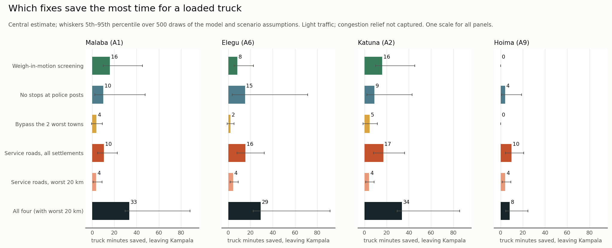{6.3}

## 4.5 Cost, reliability, fuel and carbon

At central values, delay costs heavy trucks about US$41 million a year across the five roads (Figure @F11):

- US$19.5 million on the Malaba road, which carries some 1,540 trucks a day;
- US$7.4 million on the Katuna road and US$6.8 million on the Elegu road;
- US$5.3 million on the Bwera road and US$2.5 million on the Hoima road.

Per trip, a loaded truck loses US$25–67. The annual figures rest on surveyed counts for the Malaba, Katuna and Bwera roads and assumed counts for the other two, and their ranges are wide (US$12–47 million on the Malaba road alone).

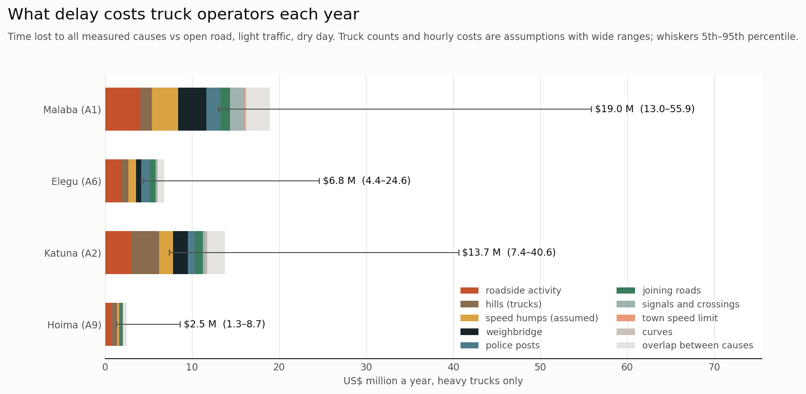{6.3}

Rain adds a further 24–53 truck-minutes on a wet day. Replaying 2006–2025, the 95th-percentile day is 5–8% slower than a typical day, and the Malaba road is the least reliable: its buffer index is 7.7%, with 87 days a year more than 2% slower (Figure @F12). The flood-exposure ranking puts the Busabi and Butema wetland stretches on the A1 and Lbanda, Kaziru and Kyoko on the A2 first. The Mpondwe stretch where a flood destroyed the Uganda–DR Congo bridge in May 2020 ranks at the 92nd percentile on the A5. The ranking finds fragile places but would not have singled out that one (Figure @P5).

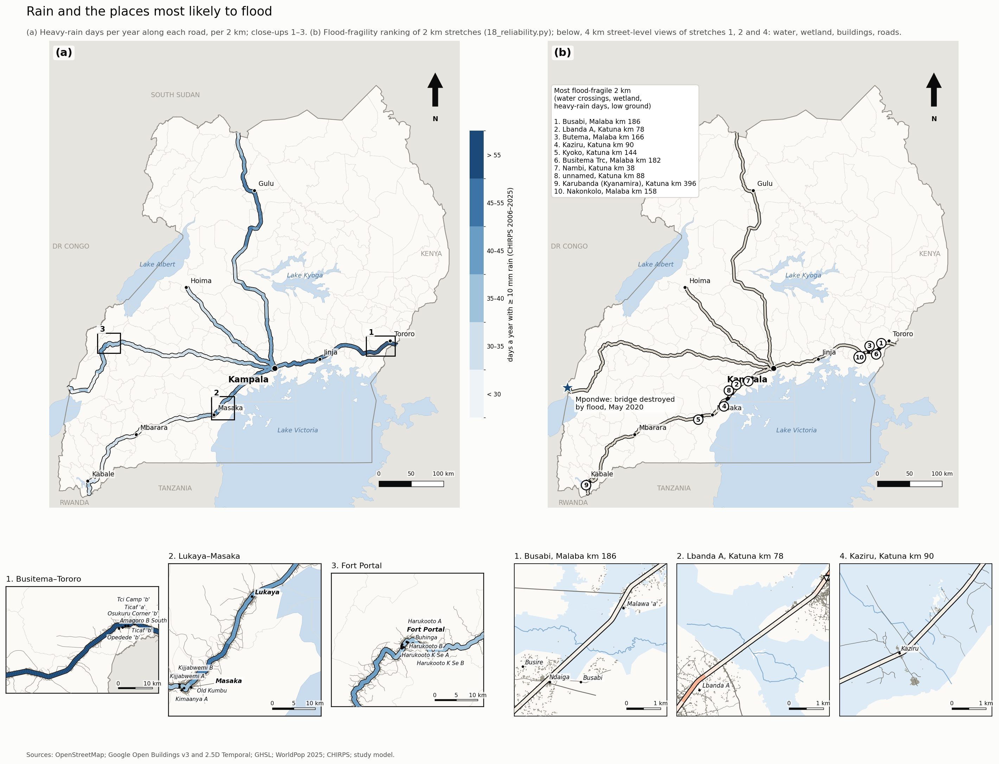{6.3}

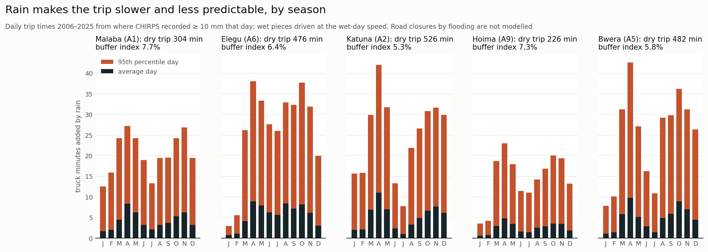{6.3}

Roadside friction burns an extra 29–75 litres of diesel per loaded truck trip (Figures @P4 and @F13), 25–41% of the trip's fuel. Across the five roads this is about 52 million litres, 138 kt of CO₂ and US$70 million of diesel a year at central values. The Malaba road accounts for nearly half (63 kt). Roadside activity and joining roads are the largest fuel causes on most roads, because they force repeated slow-downs and re-accelerations; on the Malaba road the assumed humps (20 L) lead. Hills and town limits are slightly negative: a truck held to a lower speed burns less fuel against air resistance. The assumed humps make the Malaba figure the least certain.

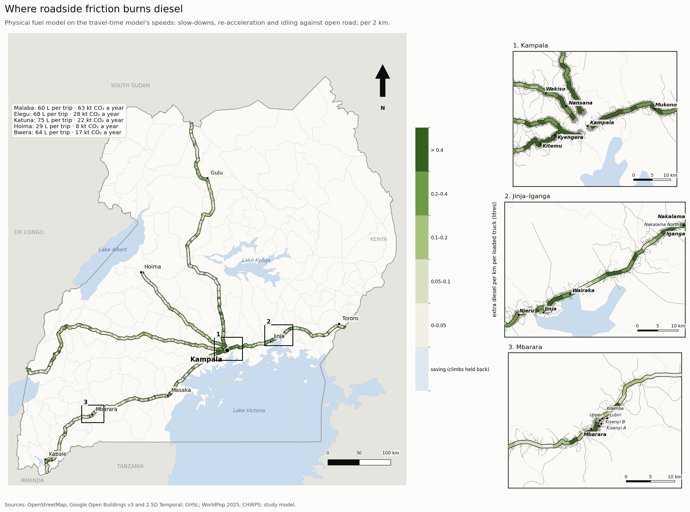{5.6}

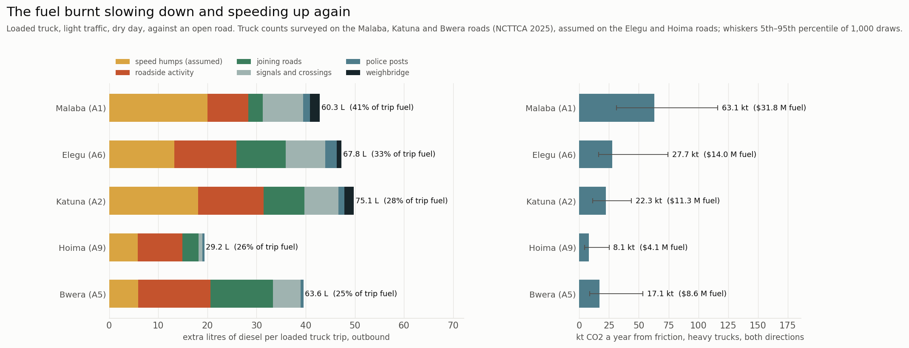{6.3}

## 4.6 People beside the road

About 1.18 million people live within 300 m of the five roads. Roadside settlements hold 49–76% of them but 65–79% of the exposure, because trucks there still average about 56 km/h. In towns, by contrast, the speed limit and friction hold trucks near 43 km/h (Figures @P3 and @F14). The highest-exposure stretches are the A1's first 8 km through Nakawa and Kireka, and the approaches to Jinja. In 688 half-km pieces, a school, trucks above 50 km/h and no mapped crossing within 500 m coincide; this is an upper bound, since OSM under-records crossings.

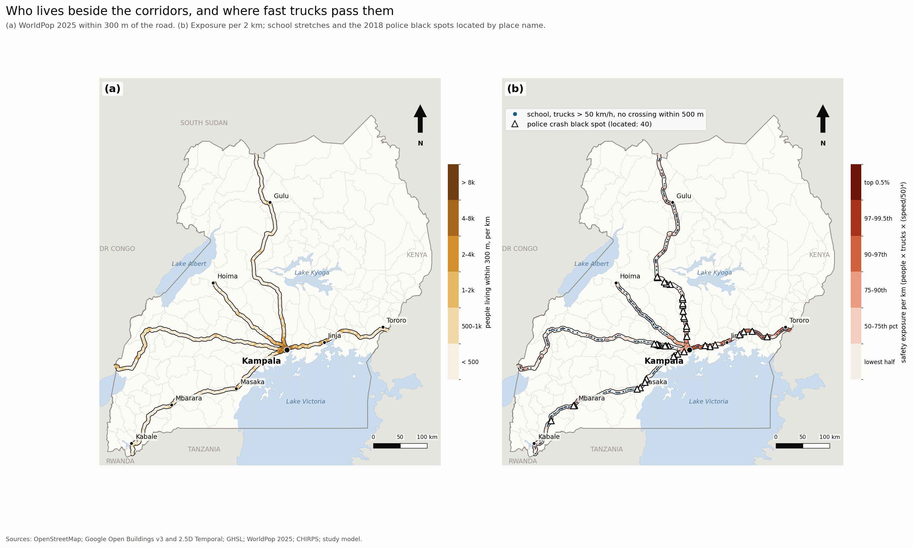{6.3}

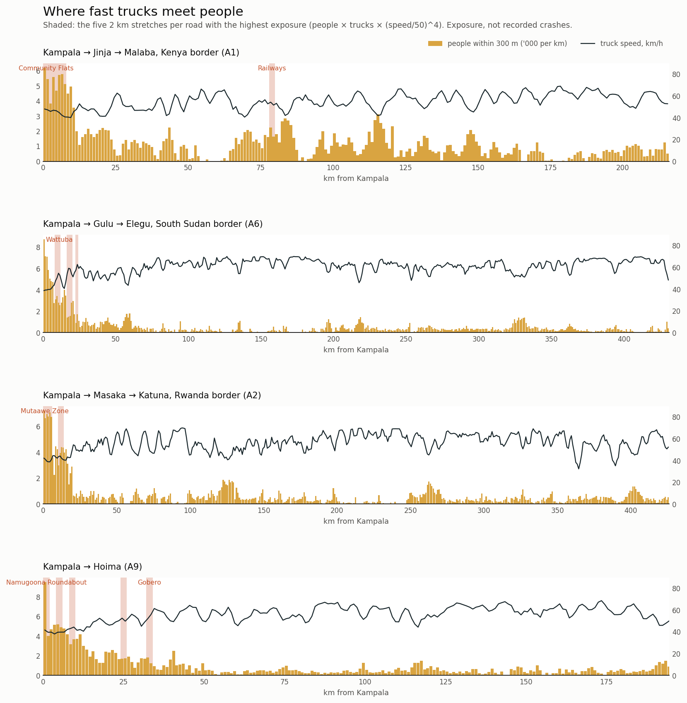{6.3}

Of 58 crash black spots named by police traffic officers, 40 can be located on the roads (Figures @P3(b) and @F15). Compared with random stretches near a named place, their stretches rank high on roadside buildings (71st percentile, p < 0.001) and joining roads (65th, p = 0.003). They rank low on truck speed (32nd, p < 0.001). Black spots are therefore busy trading centres where traffic slows and mixes, not fast open bends. The exposure index points at them only weakly (59th percentile, p = 0.08), because its speed⁴ term favours fast stretches. Officers' judgement and the power model thus disagree about where risk lies, and the paper reports both.

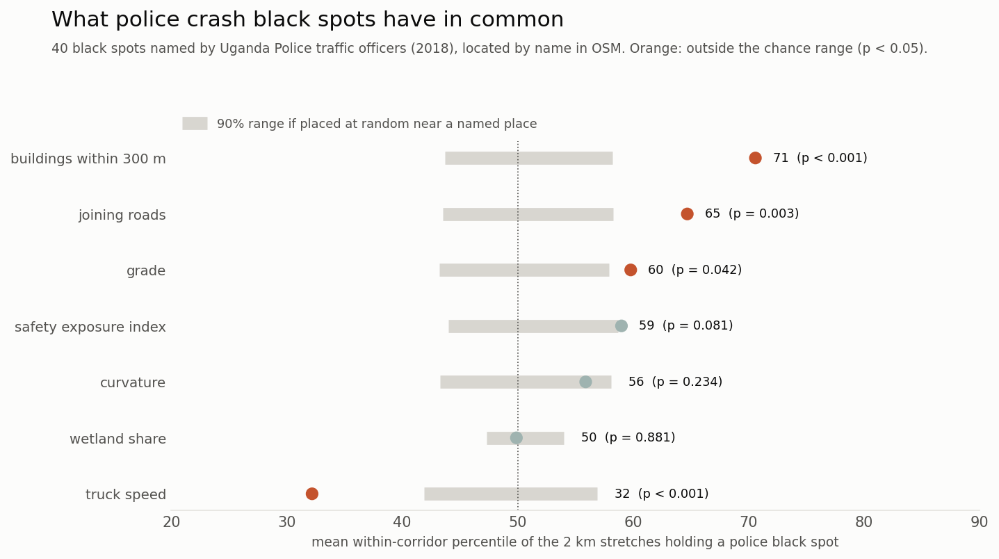{6.3}

## 4.7 Friction in the whole trip

The Observatory's GPS and cargo-tracking data put Kampala-to-border transit at 17–93 hours in 2025–26, against 5–9 hours of modelled driving (Figure @F16). Roadside and control friction, at 1.8–2.7 hours per trip, is therefore 2–14% of the real door-to-door time. The rest is stopped time: by drivers' own records, rest and meals take 63% of stopped time and border procedures 23%. The Malaba border crossing itself averaged 48 minutes in 2025, less than the two hours of friction between Kampala and the border. The Observatory's measured median weighbridge stop of 12 minutes supports the model's 10-minute assumption.

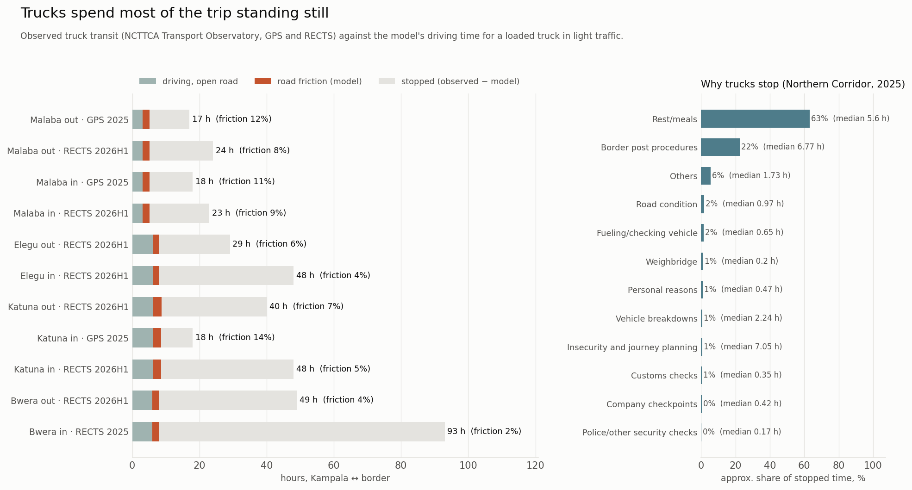{6.3}

## 4.8 Trucks from space (experimental)

No open traffic counts exist along most of the corridors, so the study also tested whether moving trucks can be seen in Sentinel-2 imagery. Because the satellite's colour bands are recorded a fraction of a second apart, a moving vehicle appears as offset colour fringes (Fisser et al., 2022). Candidates were drawn from clear scenes in 2023–2025, and 321 image chips were labelled by hand. A classifier on these chips reached 72% precision and 76% recall in five-fold cross-validation (AUC 0.92), against 38% precision for the fixed threshold. Even so, the index detects only a fraction of the trucks a busy corridor should hold, and it confuses roofs and clutter in towns with trucks. It is therefore usable only as a relative index on open-road stretches, and it is not used in the travel-time model. It does suggest that a calibrated satellite truck count is within reach where ground counts are missing.

# 5. Discussion

## 5.1 Friction is structural, and growing

The corridors were built as inter-city roads but now function, for most of their length, as linear towns. Roadside settlement is not an exception at a few trading centres; it is the majority condition, and it is still spreading at 3–6% a year in building counts. The time it costs is moderate per trip: one to two hours for a loaded truck, against a day or more of stopped time. It is paid on every trip, by every vehicle and in both directions, and it grows with the roadside. It also costs fuel out of proportion to time, because the energy lost is in braking and re-accelerating, not in waiting. A third of a loaded truck's diesel on these roads is spent on friction.

## 5.2 The main cause depends on the vehicle and the road

For cars the answer is robust: roadside activity. For trucks it is not, and the reasons are informative. Where weighbridges and police posts are present, their stop times dominate, and they are both the most uncertain inputs and the cheapest to change. Where the road climbs, hills matter more, and only realignment or climbing lanes would change that. Policy discussion of corridor delay tends to name a single culprit, whether weighbridges, checkpoints or roadside trade. These results suggest the culprit differs by road and is uncertain even then. The useful output is the ranking together with its stability.

## 5.3 What to fix first

Per minute saved and per shilling spent, the control points rank first. Weigh-in-motion screening at the five weighbridges would remove 8–16 minutes per trip on three roads for the cost of a few installations. Ending routine stops at police posts would save 4–15 minutes for the cost of an instruction. Neither changes the roadside.

Service roads and bypasses are an order of magnitude more expensive per minute saved. They should be targeted at the worst 20 km of each road, which return three times the time per kilometre built. They should also be planned with land-use control, or the new frontage will attract the same settlement. Bypasses near Kampala are justified, if at all, by peak congestion, which this model does not measure.

Rail does not solve the problem. On the Malaba road, 81% of truck delay lies within 10 km of the metre-gauge line that the standard gauge railway would follow. Yet moving 30% of truck freight to rail pays back at most 9% of its cost on Uganda's own traffic.

## 5.4 Safety and friction pull in different directions

Measures that raise truck speed through settlements, such as removing humps or widening without separation, would cut delay and fuel but raise exposure as the fourth power of speed. The black-spot test shows that officers already see danger at the slow, busy trading centres, not only at the fast stretches. The answer consistent with both is separation rather than speed: service roads, protected crossings near schools, and bus and taxi bays that take stopping vehicles off the carriageway. These measures remove friction for through traffic while holding speed where people are.

## 5.5 Open data, open method

Every input except the validation records is global and openly licensed, and every assumption is listed with its range. Each corridor result can therefore be reproduced, challenged and rerun with better local values, such as a surveyed hump inventory, measured police stop times or UNRA traffic counts. The companion paper uses the same pipeline to compare 54 roads in ten countries.

## 5.6 How the estimates compare

The size of the friction effect is consistent with what site studies report. The model's largest roadside speed loss, 35% at full activity with a range of 20–50%, sits within the reductions in free-flow speed that the Indonesian manual assigns to very high side friction (Bang, 1998). It is also close to the losses measured on Indian rural highways through settlements (Pal and Roy, 2016) and on Dar es Salaam's urban links (Chiguma, 2007). The weighbridge assumption is supported by the Observatory's measured median stop. The hump and police-stop assumptions are not checked by any record, and they are the inputs that most change the ranking of causes. The results agree with the corridor literature that stopped time, not moving time, dominates door-to-door transit (Teravaninthorn and Raballand, 2009; NCTTCA, 2026a). They add that the moving part is not negligible for fuel: friction burns a quarter to two-fifths of a loaded truck's diesel on these roads, a share that time-based accounts miss.

## 5.7 Monitoring the corridors

The pipeline lends itself to monitoring. Each new release of building footprints, OSM edits to controls, or year of rainfall changes the inputs, not the method. Rerunning it would show where friction is growing fastest, before new trading centres become new bottlenecks. Three local datasets would sharpen it most:

- a surveyed inventory of speed humps;
- logged stop times at police posts and weighbridges;
- traffic counts on the Elegu and Hoima roads.

Each is cheap compared with the works it would help target.

# 6. Limitations

- **Congestion is not modelled.** Results describe light traffic. Peak-hour delay at the Kampala end, and in Jinja, Mbarara and Masaka, is larger.
- **Speed humps are assumed.** OSM records fewer than 60 near these roads; one per town piece is assumed (range 0–2). A street-level inventory would change the Malaba results most.
- **Controls are uncertain.** Police posts are OSM police stations within 30 m of the road, and whether they stop trucks is an assumption. Weighbridges are found by name, and none is mapped on the A9 or A5.
- **Roadside friction is inferred, not observed.** It is modelled from buildings and junctions, with the size of the effect taken from the literature. Site speed surveys at a sample of settlements would calibrate it.
- **The money depends on volumes.** Annual costs and emissions rest on truck counts surveyed on three roads and assumed on two, and on assumed values of time. Per-trip results do not depend on them.
- **The data have known gaps.** Open Buildings v3 reflects imagery from about 2020–22. GHSL's observed record ends in 2020. The temporal building layer is noisy year to year, so trends are fitted. Copernicus GLO-30 is a surface model, and grades are averaged over 500 m.
- **Exposure is an index.** It is not a crash risk, and police black spots are a 2018 list based on officers' judgement.
- **One road runs fast.** The model is 15% fast to Fort Portal; pavement condition on the A5 is not in the model.

# 7. Conclusion

Uganda's trade corridors have become high streets. Between half and three-quarters of each road now runs through roadside settlement that is still growing quickly. In light traffic that settlement, with its controls, humps and hills, costs a loaded truck one to three hours and 29–75 litres of diesel per trip. Across the five roads this comes to roughly US$41 million in truck time, US$70 million in fuel and 138 kt of CO₂ a year, while placing over a million people beside fast heavy traffic.

The quickest gains come from the control points: weigh-in-motion and an end to routine stops at police posts. These save as much time per trip as hundreds of kilometres of service road. The roadside itself can only be managed, not removed. Service roads, protected crossings and stopping bays on the worst stretches, together with land-use control on new frontage, would hold friction and risk down as the roadside grows. Because the method rests on open data and a stated model, each of these results can be checked and improved, and the next paper extends it across the region.

# Data and code availability

All code, derived tables and figures are at https://github.com/gavacharles/uganda-trade-corridors. An interactive explorer is at https://gavacharles.github.io/uganda-trade-corridors/.

# References

Arvis, J.-F., Raballand, G., Marteau, J.-F., 2010. The Cost of Being Landlocked: Logistics Costs and Supply Chain Reliability. World Bank, Washington, DC.

Bang, K.-L., 1998. Indonesian highway capacity manual: impact of side friction on speed–flow relationships. In: Proceedings of the Third International Symposium on Highway Capacity, Copenhagen. Danish Road Directorate, pp. 47–70.

Barrington-Leigh, C., Millard-Ball, A., 2017. The world's user-generated road map is more than 80% complete. PLOS ONE 12(8), e0180698.

Barth, M., Boriboonsomsin, K., 2008. Real-world carbon dioxide impacts of traffic congestion. Transportation Research Record 2058, 163–171.

Bennett, C.R., Greenwood, I.D., 2001. Modelling Road User and Environmental Effects in HDM-4. HDM-4 Documentation Volume 7. PIARC, Paris, and World Bank, Washington, DC.

Chiguma, M.L.M., 2007. Analysis of Side Friction Impacts on Urban Roads: Case Study Dar-es-Salaam. PhD thesis, Royal Institute of Technology (KTH), Stockholm.

Demir, E., Bektaş, T., Laporte, G., 2014. A review of recent research on green road freight transportation. European Journal of Operational Research 237(3), 775–793.

Elvik, R., 2009. The Power Model of the Relationship between Speed and Road Safety: Update and New Analyses. TØI Report 1034/2009. Institute of Transport Economics, Oslo.

FHWA, 2006. Travel Time Reliability: Making It There On Time, All The Time. Federal Highway Administration, Washington, DC.

Fisser, H., Khorsandi, E., Wegmann, M., Baier, F., 2022. Detecting moving trucks on roads using Sentinel-2 data. Remote Sensing 14(7), 1595.

Funk, C., Peterson, P., Landsfeld, M., et al., 2015. The climate hazards infrared precipitation with stations—a new environmental record for monitoring extremes. Scientific Data 2, 150066.

Jaramillo, P., Kahn Ribeiro, S., Newman, P., et al., 2022. Transport. In: Climate Change 2022: Mitigation of Climate Change. Contribution of Working Group III to the Sixth Assessment Report of the IPCC. Cambridge University Press, Cambridge.

Jedwab, R., Storeygard, A., 2022. The average and heterogeneous effects of transportation investments: evidence from sub-Saharan Africa 1960–2010. Journal of the European Economic Association 20(1), 1–38.

Kunaka, C., Carruthers, R., 2014. Trade and Transport Corridor Management Toolkit. World Bank, Washington, DC.

NCTTCA, 2025. Northern Corridor GHG Emissions Baseline Report 2025. Northern Corridor Transit and Transport Coordination Authority, Mombasa.

NCTTCA, 2026a. Northern Corridor Transport Observatory Report, 21st edition. Northern Corridor Transit and Transport Coordination Authority, Mombasa.

NCTTCA, 2026b. Northern Corridor Transport Observatory Biannual Report, January–June 2026. Northern Corridor Transit and Transport Coordination Authority, Mombasa.

Nilsson, G., 2004. Traffic Safety Dimensions and the Power Model to Describe the Effect of Speed on Safety. Bulletin 221, Lund Institute of Technology, Lund.

Pal, S., Roy, S.K., 2016. Impact of roadside friction on travel speed and LOS of rural highways in India. Transportation in Developing Economies 2, 9.

Pesaresi, M., Politis, P., 2023. GHS-BUILT-S R2023A: GHS built-up surface grid, derived from Sentinel-2 composite and Landsat, multitemporal (1975–2030). European Commission, Joint Research Centre.

Sirko, W., Kashubin, S., Ritter, M., et al., 2021. Continental-scale building detection from high resolution satellite imagery. arXiv:2107.12283.

Storeygard, A., 2016. Farther on down the road: transport costs, trade and urban growth in sub-Saharan Africa. Review of Economic Studies 83(3), 1263–1295.

Tatem, A.J., 2017. WorldPop, open data for spatial demography. Scientific Data 4, 170004.

Teravaninthorn, S., Raballand, G., 2009. Transport Prices and Costs in Africa: A Review of the International Corridors. World Bank, Washington, DC.

TRB, 2016. Highway Capacity Manual, 6th edition. Transportation Research Board, Washington, DC.

Uganda Police Force, 2018. Accident black spots on Uganda's roads, as identified by traffic officers. Directorate of Traffic and Road Safety, Kampala.

WHO, 2023. Global Status Report on Road Safety 2023. World Health Organization, Geneva.
