title: Leaving the capital
subtitle: Roadside friction on 54 roads out of twelve East and Southern African hubs
author: Charles Gava
affil: [Affiliation]
email: gavacharles85@gmail.com

# Abstract

The main roads leaving Africa's capitals carry national and transit freight, but many also serve as the high street of continuous roadside settlement. This paper asks how much time, fuel and risk that settlement and the controls along the roads cost. It also asks whether the answer differs between East and Southern Africa. Every numbered national route longer than 100 km leaving twelve hubs in ten countries is identified automatically from OpenStreetMap. The East African hubs are Kampala, Nairobi, Kigali, Dodoma and Dar es Salaam. The Southern African hubs are Pretoria, Johannesburg, Gaborone, Harare, Lusaka, Maputo and Windhoek. The 54 roads, 15,356 km in all, are divided into 30,711 pieces of 500 m. A cause-by-cause travel-time model developed for Uganda is run on every piece, with 1,000 Monte Carlo draws over its assumptions. Road types are clustered jointly across the region, so the same label means the same thing everywhere. Over the first 200 km of each road, a loaded truck loses a median 35 minutes per 100 km against open-road conditions on East African roads, twice the 18 minutes of Southern African roads. East African roads run through roadside settlement or towns for about two-thirds of their length (medians of 54% and 14%), against about a third in the South (31% and 4%). They have 4.5 times the buildings within 100 m per km and 4.5 times the people living within 300 m, and their roadside grew faster between 2000 and 2020 (54% against 35%). Across all 54 roads, roadside building density alone correlates with lost time at r = 0.73. The causes differ by region. In the East, roadside activity, assumed speed humps and weighbridges dominate. In the South, signals and crossings account for a third of truck delay, but their density reflects far more complete mapping of controls in South Africa as well as real differences. Roadside friction raises a loaded truck's fuel use by a median 11 litres per 100 km in the East against 9 in the South. East African roads also carry 2.5 times the safety exposure per km. The results suggest that East Africa's trade corridors have become linear towns in a way most Southern African corridors have not. Remedies are therefore better targeted at the roadside and at the control points than at the pavement.

**Keywords:** trade corridors; side friction; ribbon development; East Africa; Southern Africa; OpenStreetMap; comparative transport geography

# 1. Introduction

Freight leaving an African capital by road must first get out of town, and in many countries "town" no longer ends at the city boundary. Paved national roads attract trading centres, markets, fuel stations, taxi stages and houses. Over decades these merge into continuous ribbons of settlement that the road was never designed to serve. Traffic slows for pedestrians, motorcycle taxis, stopping minibuses and turning vehicles. Speed humps are installed to protect residents, and police checks and weighbridges sit within the same built-up stretches. For a loaded truck each slow-down costs time, and each re-acceleration costs fuel. Each pass at speed through a settlement also exposes the people who live there.

A companion paper measured these costs on Uganda's five trade corridors (Gava, 2026). It found that roadside settlement now covers 56–74% of each road, and that a loaded truck loses one to three hours per trip in light traffic. The same paper found that weigh-in-motion and an end to routine police stops would save more time per trip than hundreds of kilometres of service roads. Whether Uganda is typical is an open question. East African corridors are often described as more congested and costlier than Southern African ones (Teravaninthorn and Raballand, 2009). The usual explanations, however, are borders, ports and the structure of the trucking industry, not the roadside. Southern Africa's main roads, many built to higher standards and with more dual carriageway, pass through landscapes with far less roadside settlement outside the metropolitan regions.

This paper extends the Uganda method to every major road leaving twelve hubs in ten countries, five in East Africa and seven in Southern Africa. It asks four questions:

- How much of each road now runs through roadside settlement, and how fast has it been building up?
- How much time does a loaded truck lose against open-road conditions, and to which causes?
- How do fuel, carbon and safety exposure follow?
- Do the answers differ systematically between East and Southern Africa, and between countries?

The contribution is a consistent, open-data comparison at a scale that site studies of side friction cannot reach. Every road is identified by the same rule. Every cause is measured from the same global datasets, and every assumption is the same, so the differences between roads reflect the roads and their roadsides rather than differences in method. The method's main weakness becomes part of the result: OpenStreetMap maps some causes, especially signals and crossings, far more completely in some countries than in others. The paper shows where this matters and reports the comparisons that do not depend on it.

Section 2 reviews the literature. Section 3 describes the hubs, roads, data and model. Section 4 reports results, Section 5 discusses them, Section 6 sets out the limitations and Section 7 concludes.

# 2. Literature

## 2.1 Comparing corridors

The comparative literature on African corridors is dominated by price and time surveys of freight between ports and inland capitals. Teravaninthorn and Raballand (2009) found transport prices in East and Central Africa far above those in Southern Africa. They attributed the gap mainly to the trucking market, low vehicle use and slow procedures at borders and ports, rather than to road condition, and found Southern African trucking more competitive and better used. Arvis et al. (2010) emphasised the cost of unreliability for landlocked countries. The Africa Infrastructure Country Diagnostic documented large differences in road density, paving and condition across the continent (Foster and Briceño-Garmendia, 2010). Corridor observatories now publish transit times by GPS and cargo tracking (NCTTCA, 2026). None of these sources measures what happens along the road between the control points, or compares it across regions.

## 2.2 Side friction and ribbon development

Side friction lowers speed and capacity where roadside activity spills onto the carriageway (Bang, 1998; TRB, 2016). Site studies in Dar es Salaam (Chiguma, 2007) and on Indian rural highways (Pal and Roy, 2016) measured its effect directly, and HDM-4 represents it as a side-friction factor on desired speed (Bennett and Greenwood, 2001). The growth of settlement along roads is well documented in the economics of African transport: lower transport costs raised urban growth (Storeygard, 2016), and road investment concentrated population along improved links (Jedwab and Storeygard, 2022). Global built-up layers now let roadside growth be measured anywhere (Pesaresi and Politis, 2023; Sirko et al., 2021). The two literatures have rarely been joined, so the cost to through traffic of the settlement a road attracts has not been compared across countries.

## 2.3 Open data for comparison

OpenStreetMap's road network is close to complete at the national level (Barrington-Leigh and Millard-Ball, 2017), but the completeness of point features varies widely between countries and contributor communities (Haklay, 2010). For comparative work this is the central risk: a cause that is mapped in one country and not in another will appear as a difference between the countries. Building footprints and built-up layers derived from imagery are more consistent, because they come from one model applied everywhere. This paper therefore leans on buildings for its headline comparisons and treats mapped controls with caution.

## 2.4 Safety and emissions

Speed raises crash severity steeply; the power model links fatal crashes to roughly the fourth power of mean speed (Nilsson, 2004; Elvik, 2009). Most road deaths in the region are pedestrians and riders of two-wheelers (WHO, 2023), concentrated where fast traffic meets people. Stop-and-go driving raises the fuel use and CO₂ of heavy vehicles (Barth and Boriboonsomsin, 2008; Demir et al., 2014), and road freight is a growing share of transport emissions in Africa (Jaramillo et al., 2022).

# 3. Study area, data and methods

## 3.1 Hubs and roads

The twelve hubs are five East African capitals and trade hubs (Kampala, Nairobi, Kigali, Dodoma, Dar es Salaam) and seven Southern African ones (Pretoria, Johannesburg, Gaborone, Harare, Lusaka, Maputo, Windhoek). Dar es Salaam is included alongside Dodoma because most Tanzanian trade roads leave from the port city. Pretoria and Johannesburg are treated as separate hubs.

The arteries are found automatically from OpenStreetMap. An artery is every national route (motorway, trunk or primary, with a route number) that passes within 8 km of the hub's centre, followed along that number to its end. Short untagged gaps are bridged, and the route is cut at the national border. A route leaving the city in two directions counts as two arteries, and routes shorter than 100 km are left out. Countries tag their roads differently, so all three classes count. The rule yields 54 arteries (Table 1; Figure @F1): 20 in the East and 34 in the South, 15,356 km in all.

Comparisons use two lengths. The headline comparison uses the first 200 km of every artery, the same length everywhere, so that long rural routes do not dilute the comparison. The main freight routes are also run their full length inside the country as *trade corridors*: Nairobi–Mombasa, Nairobi–Malaba, Dar es Salaam–Tunduma, Johannesburg–Durban, Pretoria–Beitbridge, Lusaka–Nakonde, Windhoek–Walvis Bay and others, 23 in all. Kampala's five arteries are the Uganda study's corridors.

Table: Table 1. Hubs and arteries.

| Region | Hub | Country | Arteries |
|---|---|---|---|
| East | Kampala | Uganda | 5 |
| East | Nairobi | Kenya | 4 |
| East | Kigali | Rwanda | 4 |
| East | Dar es Salaam | Tanzania | 3 |
| East | Dodoma | Tanzania | 4 |
| Southern | Johannesburg | South Africa | 8 |
| Southern | Pretoria | South Africa | 5 |
| Southern | Gaborone | Botswana | 3 |
| Southern | Harare | Zimbabwe | 6 |
| Southern | Lusaka | Zambia | 5 |
| Southern | Maputo | Mozambique | 2 |
| Southern | Windhoek | Namibia | 5 |

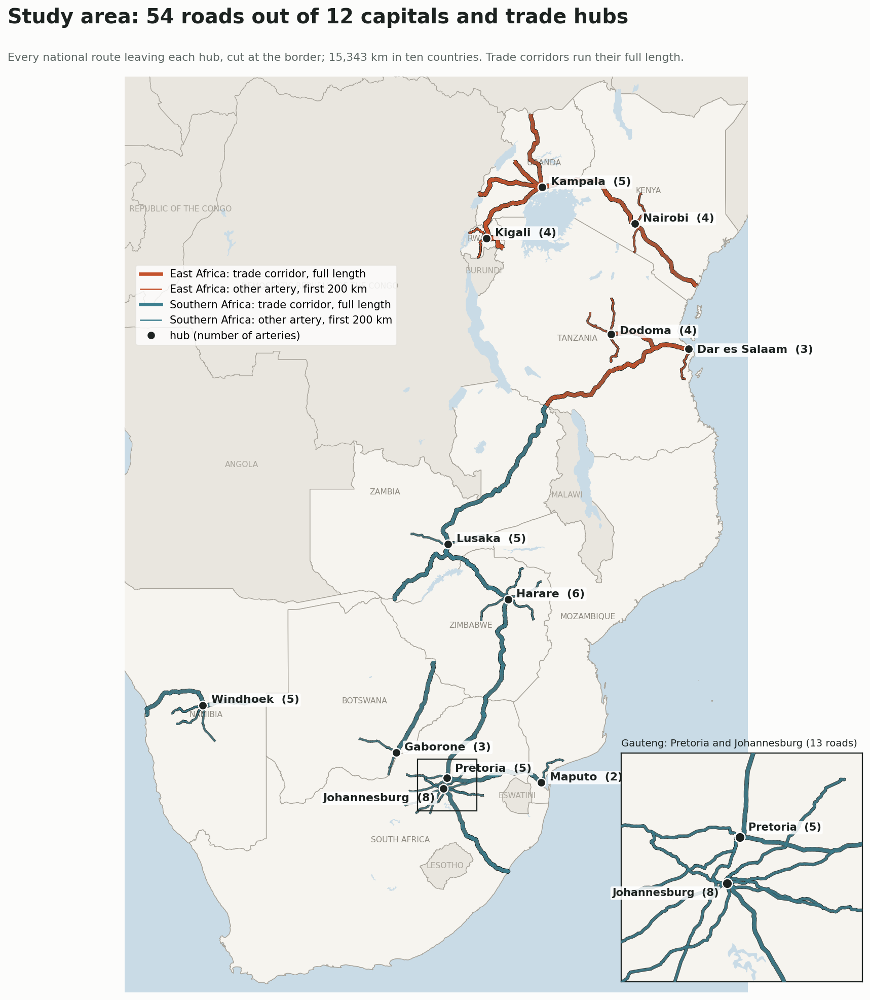{6.3}

## 3.2 Data

The data are those of the Uganda study, extended to ten countries:

- OpenStreetMap extracts for each country (Geofabrik), for routes, junctions, controls, places, water and land use;
- Google Open Buildings v3 footprints within 1 km of every road, 8.1 million buildings (Sirko et al., 2021);
- Copernicus GLO-30 elevation;
- CHIRPS daily rainfall for 2006–2025 (Funk et al., 2015);
- GHSL built-up surface for 2000–2020 (Pesaresi and Politis, 2023).

Population is GHS-POP 2025 (Schiavina et al., 2023), a single global product, rather than the WorldPop country rasters used for Uganda. This keeps the population layer consistent across ten countries.

Weighbridges are found by name, as in Uganda. South Africa's toll plazas are not a separate cause.

## 3.3 Pieces, road types and causes

Each artery is cut into 500 m pieces, and every measure is attached to the piece it falls in. The measures are:

- buildings within 100 m and 300 m;
- shops, markets, schools, fuel stations and bus or taxi stops;
- major and minor joining roads;
- signals, pedestrian and level crossings, OSM speed humps, police posts and weighbridges;
- dual carriageway and curvature;
- grade and climb;
- waterway crossings, wetland and heavy-rain days.

Road types are found by k-means on standardised roadside measures, clustered **jointly across all 54 roads**. A piece labelled "roadside settlement" in Windhoek is therefore as built-up as one in Kampala. As in Uganda, three types (open road, roadside settlement, town) are chosen by silhouette score.

## 3.4 Travel-time model and extensions

The travel-time model is the Uganda study's, unchanged. Each piece's speed starts at an open-road speed, 90 km/h for a car on a single carriageway, 100 km/h on a dual carriageway and 70 km/h for a loaded truck. It is then reduced:

- by roadside activity, up to 35% at 300 buildings within 100 m;
- by joining roads, up to 15% at ten or more per piece;
- by a 50 km/h town limit in town pieces;
- by curves;
- for trucks, by uphill grades.

Fixed delays are added for signals (30 s), pedestrian crossings (5 s), level crossings (15 s) and humps (8 s; one assumed per town piece). Police posts add 10 s for a car and 60 s for a truck, and weighbridges add 10 minutes for a truck. A wet day lowers speed by 10%.

Each cause's contribution is found by switching it off. One thousand Monte Carlo draws over every parameter give 5–95% ranges and the share of draws in which each cause is largest. The extensions are also unchanged:

- fix scenarios;
- rain reliability from daily CHIRPS rainfall;
- safety exposure, people within 300 m × trucks × (truck speed/50)⁴;
- a physical fuel model giving extra diesel and CO₂.

Because truck counts are not available for most roads, one truck count (1,000 a day) is assumed everywhere. Per-trip and per-km measures do not depend on it. Annual totals are indicative only and are not compared between roads.

## 3.5 Comparison and outputs

Comparisons between regions use medians across arteries. Comparisons between countries show every road as a point, with the country median, so that the spread within a country is visible. Readability set the figure design. The supplementary material holds:

- one sheet per hub showing every road in its own panel;
- twelve sheets per country;
- close-ups of the worst stretches in every country.

The main text uses the comparisons.

# 4. Results

## 4.1 How much of each road is settlement

The regions differ most in what lines the road (Table 2; Figures @M1, @F2 and @F3). Over the first 200 km, East African arteries run through roadside settlement for a median 54% of their length and through towns for 14%; open road is 23%. In the South, open road is 64%, settlement 31% and towns 4%. East African roads have a median 155 buildings within 100 m per km, against 34 in the South. Uganda and Rwanda are the extremes: 253 and 254 buildings per km, with settlement and towns covering 68–79% of their roads. Namibia is the other extreme, with 11 buildings per km and 92% open road. Within the South, Maputo's roads (159 buildings per km) and Lusaka's (64) look more like East Africa's than Pretoria's or Harare's.

Table: Table 2. East and Southern Africa compared (median across arteries, first 200 km).

| Measure | East (20 roads) | Southern (34 roads) |
|---|---|---|
| Truck minutes lost per 100 km | 35.1 | 17.8 |
| Car minutes lost per 100 km | 21.1 | 9.7 |
| Share in roadside settlement | 54% | 31% |
| Share in towns | 14% | 4% |
| Share open road | 23% | 64% |
| Buildings within 100 m per km | 155 | 34 |
| Dual carriageway | 1.7% | 14.2% |
| Controls mapped per 100 km | 1.5 | 7.5 |
| Growth of built-up land within 300 m, 2000–2020 | 54% | 35% |
| People within 300 m per km | 1,225 | 271 |
| Safety exposure per km | 1.09 | 0.44 |

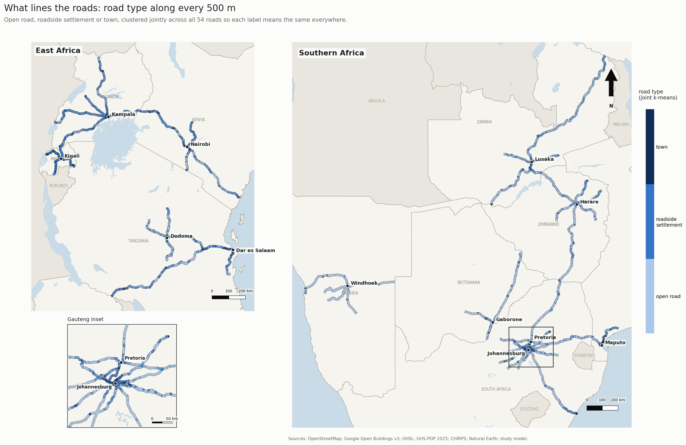{6.3}

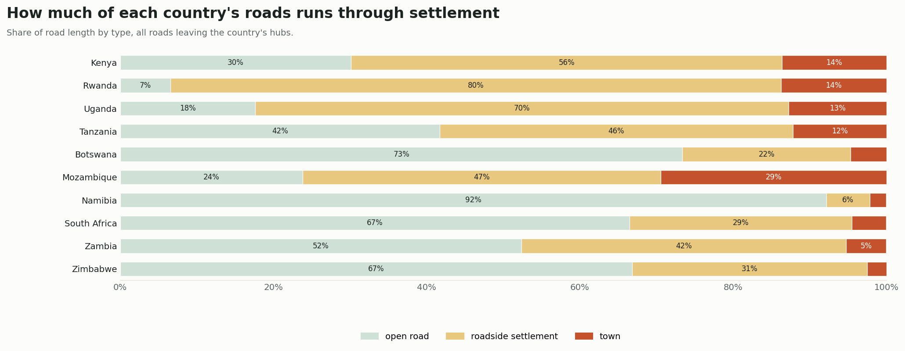{6.3}

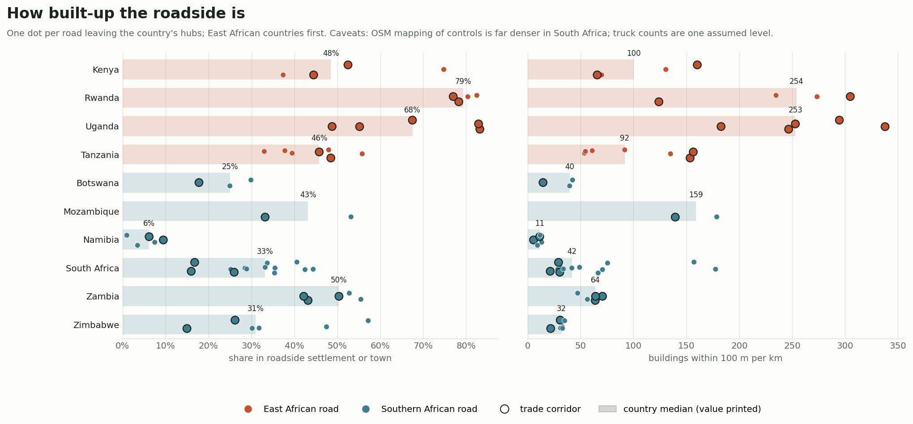{6.3}

The roadside is also building up faster in the East (Figures @M2 and @F4). Built-up land within 300 m grew by a median 54% between 2000 and 2020 on East African arteries against 35% in the South. In both regions most of the added area lies in roadside settlements: East African settlements grew 80% and Southern ones 45%, against 16–20% for towns. Kenya, Tanzania and Rwanda show the fastest growth (median 57–63%); South Africa the slowest (22%).

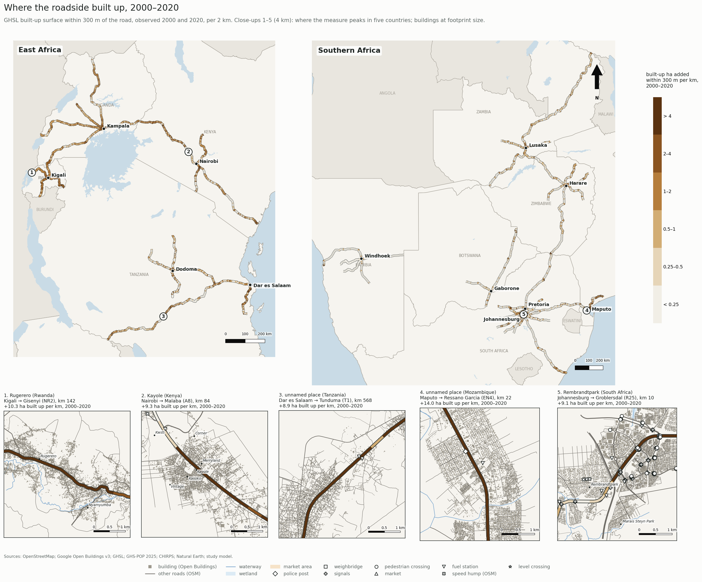{6.3}

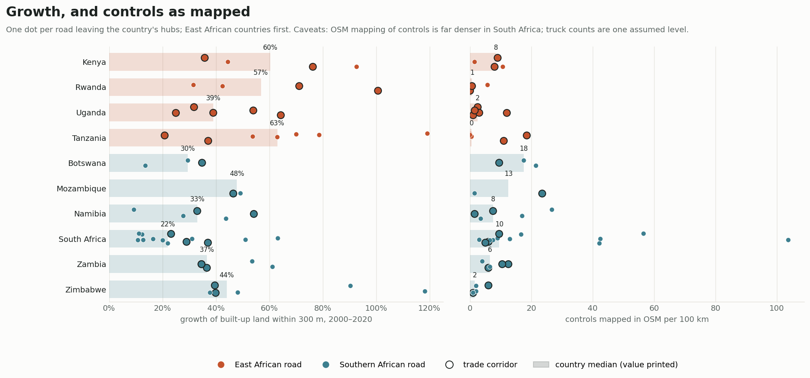{6.3}

## 4.2 Time lost

A loaded truck loses a median 35 minutes per 100 km on East African arteries and 18 in the South; cars lose 21 and 10 (Figures @M7 and @F5). Over whole roads, the loss per trip runs from 15 minutes to five hours. By hub (first 200 km), Dar es Salaam (54 minutes per 100 km), Kigali (47), Maputo (42), Nairobi (38) and Kampala (35) are worst. Harare (12), Windhoek (15), Pretoria (17) and Dodoma (18) are best. Country medians follow the same order, with Rwanda (47) and Mozambique (42) at the top and Zimbabwe (12) and Namibia (15) at the bottom.

The spread within countries is wide. Johannesburg's R24 to Rustenburg is the worst single road in the study at 92 truck-minutes per 100 km, almost entirely signals and crossings through the West Rand. Johannesburg's N3 to Durban loses 27.

{6.3}

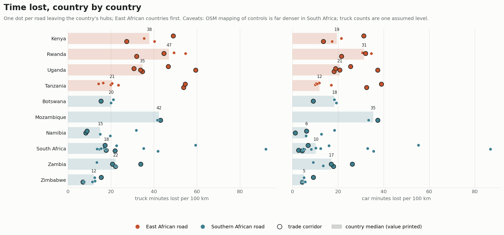{6.3}

Roadside building explains much of the variation (Figure @F6). Across the 54 roads, buildings within 100 m per km correlate with truck minutes lost per 100 km at r = 0.73. The relation holds within both regions. Southern roads with dense roadsides, such as Maputo–Ressano Garcia and Lusaka–Chirundu, lose time like East African ones. The outliers above the line are Southern roads with dense mapped controls.

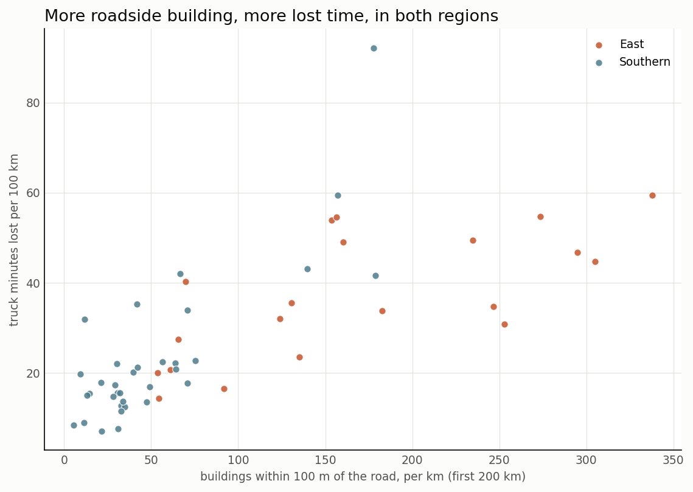{5.4}

## 4.3 Why: causes by region and country

The causes differ by region (Table 3; Figure @F7). In the East, roadside activity (20% of truck delay), assumed humps (19%), weighbridges (13%) and hills (24%) lead. In the South, signals and crossings account for 32%, hills for 24%, humps for 11% and roadside activity for only 8%.

By country:

- **Signals and crossings** lead in Botswana (48%), South Africa (41%) and Namibia (31%).
- **Roadside activity** is largest in Uganda (28%) and Rwanda (24%).
- **Weighbridges** stand out in Kenya (22%).
- **Hills** dominate in Zimbabwe (43%), Rwanda (35%) and Namibia (32%).
- **Assumed humps** are largest in Mozambique (32%).

Table: Table 3. Share of truck minutes lost by cause, all roads (central estimate).

| Cause | East | Southern |
|---|---|---|
| Hills (trucks) | 24% | 24% |
| Roadside activity | 20% | 8% |
| Speed humps (assumed) | 19% | 11% |
| Weighbridges | 13% | 7% |
| Joining roads | 8% | 6% |
| Signals and crossings | 6% | 32% |
| Police posts | 5% | 8% |
| Town speed limit | 3% | 3% |
| Curves | 3% | 1% |

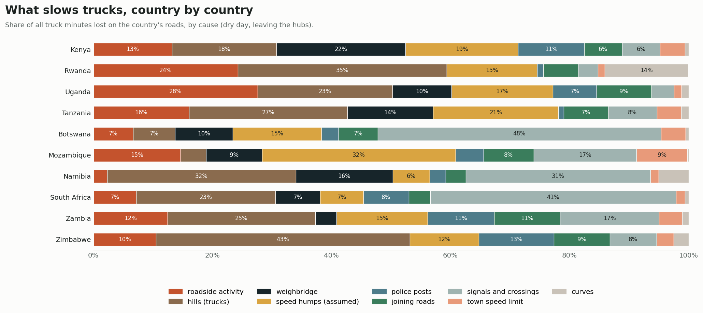{6.3}

The signals result needs care. OSM records a median 7.5 controls per 100 km on Southern arteries against 1.5 in the East. Johannesburg's arteries have 29 per 100 km, and the R24 has 104. South Africa's road network is mapped in great detail, including every signal and pedestrian crossing in Gauteng. Ugandan, Tanzanian and Rwandan towns have signals and crossings too, but far fewer are mapped. Some of the Southern signal delay is real, since the metropolitan arteries of Gauteng are signalised urban roads for their first tens of kilometres. Some of the East–South gap in controls, however, is a gap in mapping. For that reason the paper's headline comparisons rest on buildings, junctions and terrain, which come from imagery and elevation rather than from mappers. Figure @M6 maps the gap. Gauteng's arteries carry more than 20 recorded controls per 10 km on many stretches, while most East African roads, including their town centres, have none recorded.

{{6.3}}

Rank stability is modest everywhere. The cause that is most often largest comes first in a median 68% of draws (range 30–100%). In the East, the leading truck cause is hills on six roads, roadside activity on five, weighbridges on five, and police posts or humps on two each. In the South, it is signals and crossings on twelve roads, hills on nine, police posts on seven and weighbridges on five.

## 4.4 The trade corridors

Table 4 and Figure @F8 set the 23 trade corridors side by side over their full length inside the country. The worst for trucks are the roads to the Kenya–Uganda border from both sides:

- Kampala–Malaba (58 minutes per 100 km);
- Nairobi–Malaba (45);
- Kigali–Rusumo (45);
- Maputo–Ressano Garcia (43).

The best are Harare–Beitbridge (6), Windhoek–Walvis Bay (7), Gaborone–Ramokgwebana (9) and Windhoek–Buitepos (10). The Northern Corridor carries the region's heaviest transit flows, and it crosses the most continuous roadside settlement. Kampala–Malaba has 330 buildings within 100 m per km, Nairobi–Malaba 166. Nairobi–Mombasa, the Corridor's busiest section, loses only 19 minutes per 100 km. Its settlement is concentrated near Nairobi and Mombasa, and much of the road between crosses open country.

Table: Table 4. Trade corridors, full length inside the country (truck minutes lost per 100 km; buildings within 100 m per km; safety exposure per km).

| Trade corridor | km | Truck min/100 km | Buildings/km | Settlement + town | Exposure/km |
|---|---|---|---|---|---|
| Kampala–Malaba (A1) | 213 | 57.6 | 330 | 85% | 1.39 |
| Nairobi–Malaba (A8) | 441 | 44.8 | 166 | 83% | 1.41 |
| Kigali–Rusumo | 159 | 44.7 | 305 | 97% | 1.47 |
| Maputo–Ressano Garcia (EN4) | 94 | 43.1 | 140 | 57% | 1.00 |
| Kampala–Katuna (A2) | 424 | 38.8 | 211 | 82% | 0.85 |
| Dar es Salaam–Dodoma | 455 | 34.8 | 116 | 66% | 1.17 |
| Lusaka–Chirundu (T2) | 136 | 33.9 | 71 | 67% | 1.04 |
| Dar es Salaam–Tunduma (T1) | 933 | 32.5 | 133 | 62% | 0.98 |
| Kigali–Gatuna (NR3) | 76 | 32.0 | 124 | 84% | 0.99 |
| Kampala–Bwera (A5) | 423 | 31.3 | 198 | 82% | 0.86 |
| Kampala–Hoima (A9) | 196 | 30.8 | 253 | 94% | 1.18 |
| Johannesburg–Durban (N3) | 572 | 27.5 | 26 | 27% | 0.40 |
| Kampala–Elegu (A6) | 431 | 26.1 | 163 | 77% | 0.88 |
| Pretoria–Beitbridge (N1) | 478 | 20.6 | 20 | 21% | 0.24 |
| Nairobi–Mombasa (A8) | 481 | 18.6 | 64 | 55% | 0.61 |
| Pretoria–Lebombo (N4) | 421 | 16.9 | 22 | 26% | 0.24 |
| Lusaka–Livingstone (T1) | 470 | 16.4 | 40 | 36% | 0.56 |
| Harare–Chirundu (A1) | 348 | 12.8 | 20 | 24% | 0.26 |
| Lusaka–Nakonde (T2) | 1,020 | 11.1 | 38 | 46% | 0.38 |
| Windhoek–Buitepos (B6) | 318 | 9.8 | 9 | 7% | 0.03 |
| Gaborone–Ramokgwebana (A1) | 501 | 9.2 | 15 | 22% | 0.14 |
| Windhoek–Walvis Bay (B2) | 397 | 7.4 | 9 | 10% | 0.06 |
| Harare–Beitbridge (A4) | 575 | 5.9 | 16 | 23% | 0.26 |

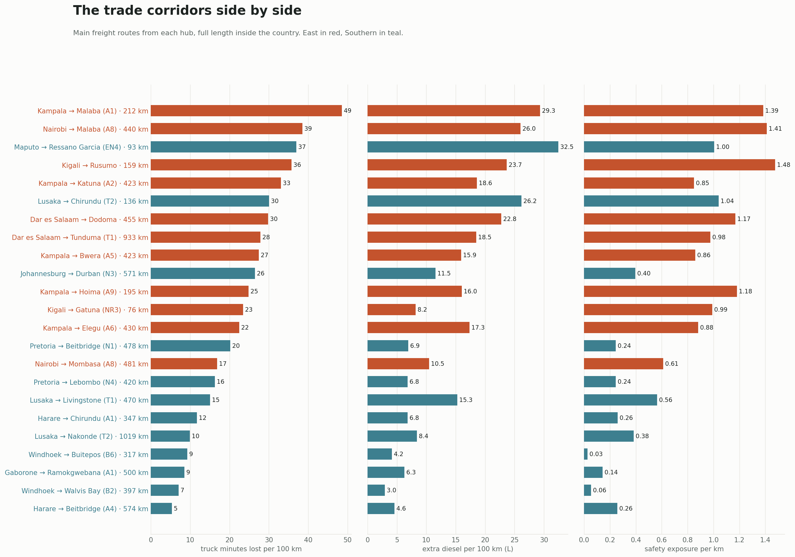{6.3}

## 4.5 Where: the worst stretches

The worst 2 km stretches fall into two groups (Figures @F9 and @S9). In the East they are weighbridges (Mlolongo and Isinya on Nairobi's roads, Mikese and Vigwaza in Tanzania, Magamaga and Lukaya in Uganda) and town entries close to the hubs. In the South they are signalised urban stretches (South Beach in Durban, Potchefstroom, Boksburg and Orange Grove in Gauteng) and weighbridges on the N1. Close-ups of these stretches in every country show the same pattern as in Uganda: continuous roofs on both sides, a dense mesh of joining roads, and controls stacked within a few hundred metres (Figures @F10 and @C2).

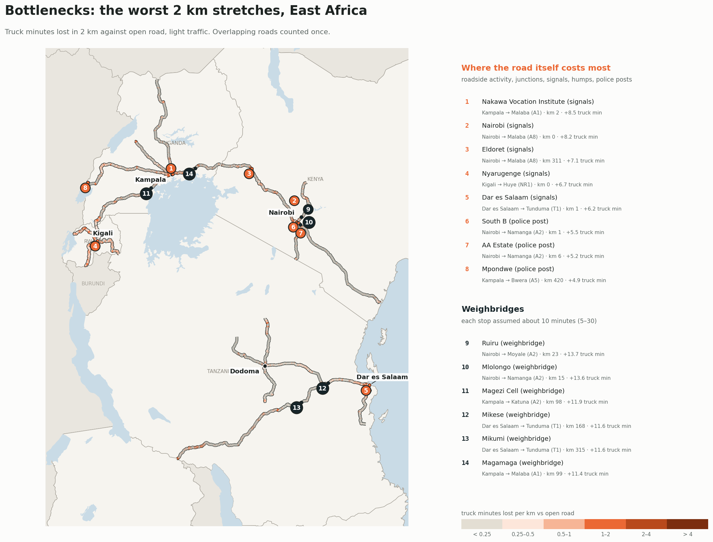{6.3}

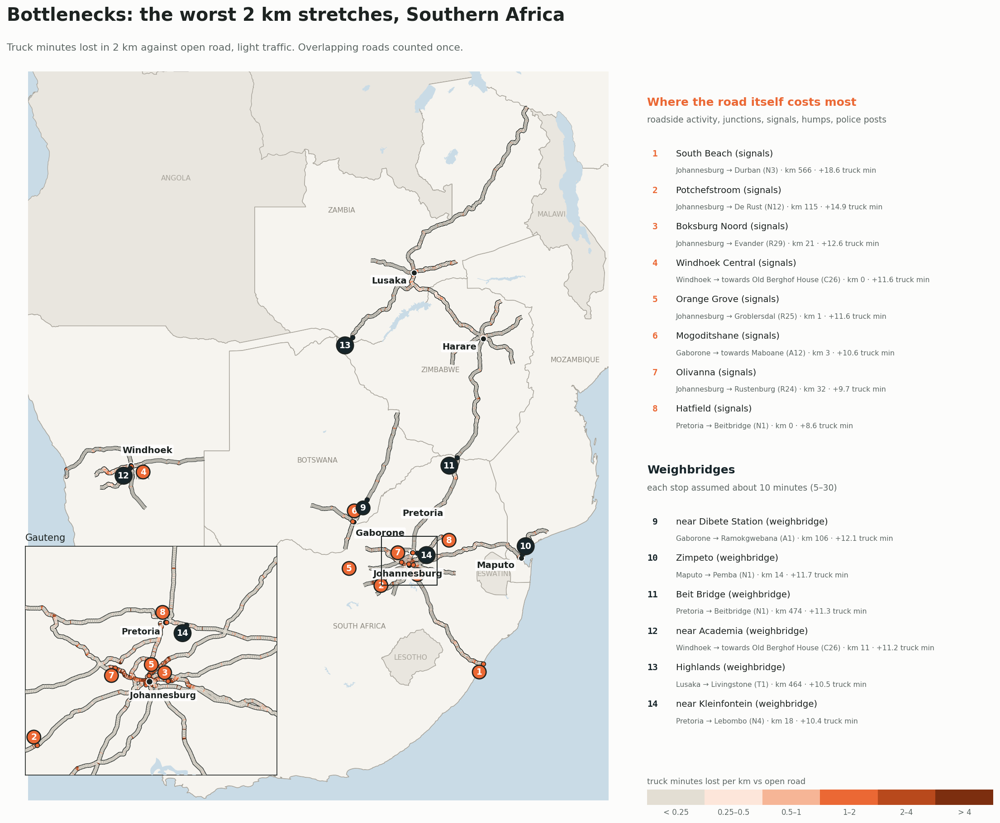{6.3}

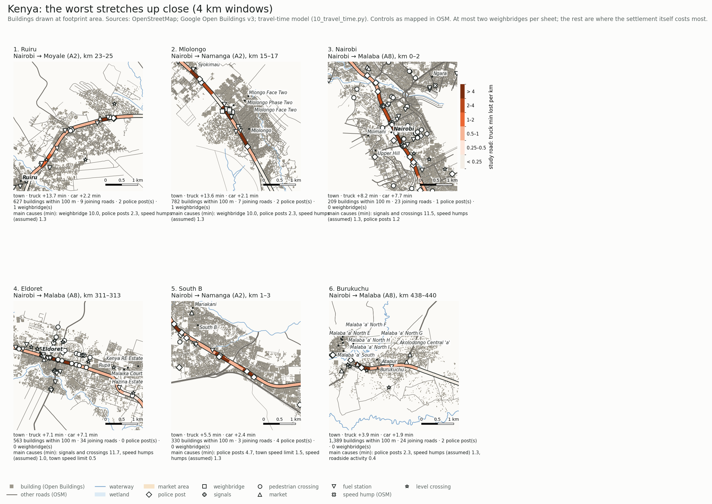{6.3}

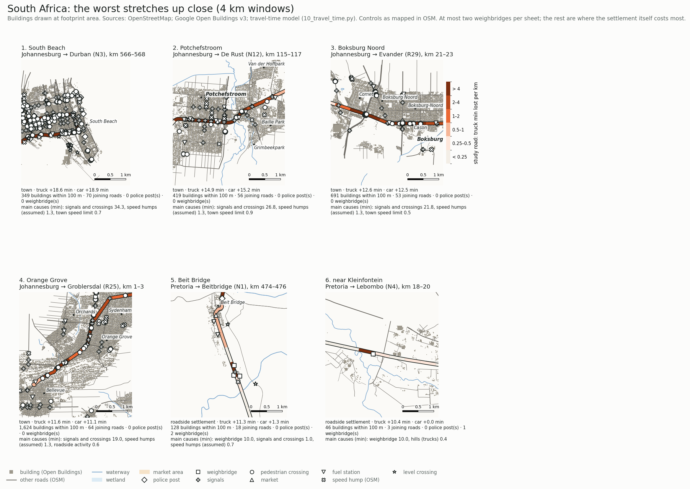{6.3}

## 4.6 Safety, fuel, reliability and fixes

About 8 million people live within 300 m of the 54 roads; some are counted twice where roads overlap near the hubs. East African arteries have a median 1,225 people within 300 m per km against 271 in the South, and 2.5 times the exposure per km (1.09 against 0.44; Figures @M3 and @F11). In both regions, roadside settlements hold about half the people but two-thirds of the exposure (65% in the East, 70% in the South), because trucks there still run fast. Towns hold 45–55% of the people but only a quarter to a third of the exposure, because the town limit and friction hold trucks down. Pieces with a school, trucks above 50 km/h and no mapped crossing within 500 m number 1,023 in the East and 202 in the South. Both counts are upper bounds where crossings are poorly mapped, so the East's count is the more inflated.

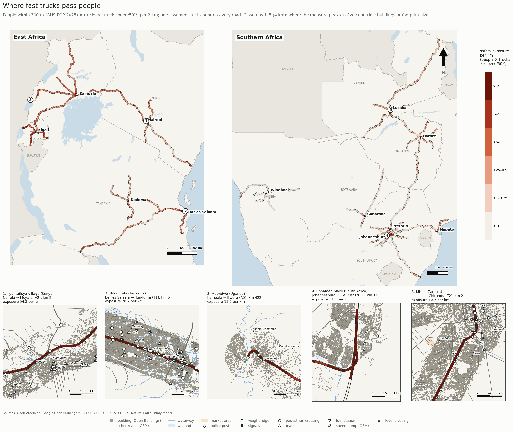{6.3}

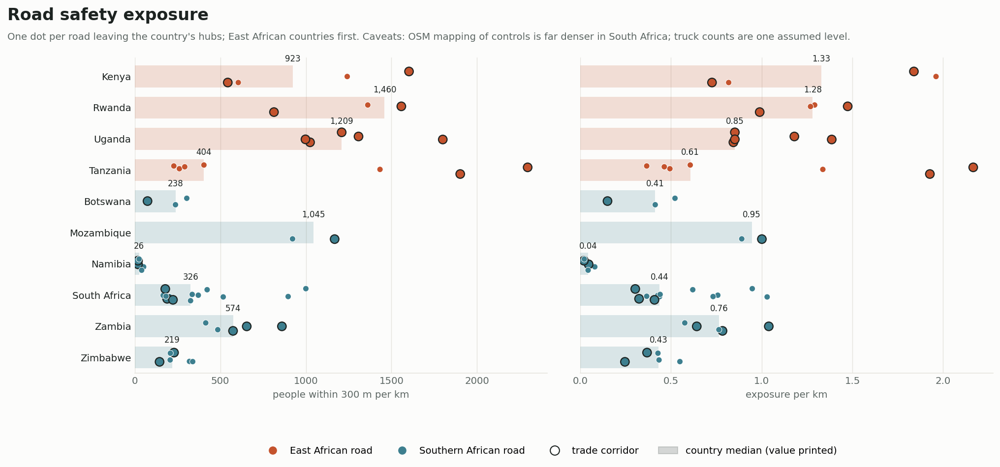{6.3}

Roadside friction raises a loaded truck's fuel use by a median 11.3 litres per 100 km in the East and 8.5 in the South (Figures @M4 and @F12). It accounts for 29% and 22% of trip fuel. Mozambique (19 litres per 100 km) and Kenya (12) are highest; Namibia (3) and Zimbabwe (5) are lowest. Gauteng's signalised R24 and R29 burn 23 litres per 100 km extra. At the assumed 1,000 trucks a day per road, friction across the 54 roads would amount to about 1.4 Mt of CO₂ a year, an order of magnitude that only real counts could firm up.

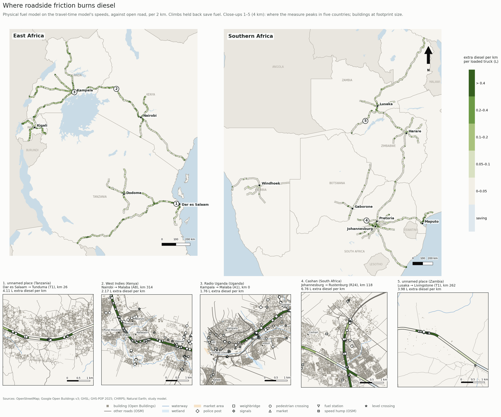{6.3}

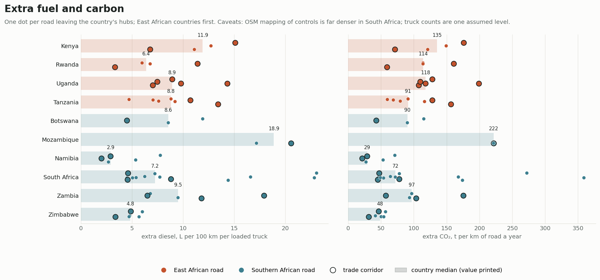{6.3}

Lost time costs a loaded truck a median US$13 per 100 km in the East and US$7 in the South. Rain makes East African roads less reliable: the buffer index for trucks, the extra time to plan for so that a truck is late on only one day in twenty, is a median 7.1% against 5.2% (Figures @M5 and @F13).

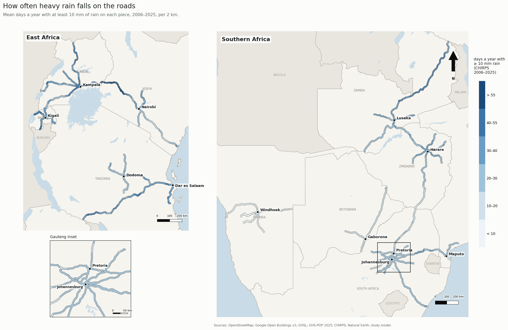{6.3}

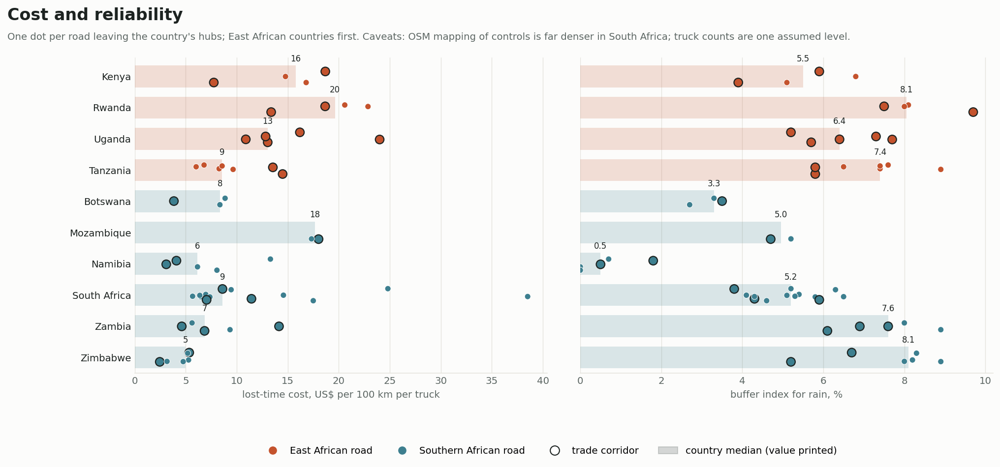{6.3}

All the fixes together (weigh-in-motion, no police stops, bypasses of the two worst towns and service roads on the worst 20 km) recover a median 16% of truck delay in the East and 18% in the South (Figure @F14). What each fix contributes differs:

- Weigh-in-motion matters on East African roads with weighbridges: a median 4% of truck delay across East African roads, against none in the South, where few weighbridges lie on the arteries' first stretches.
- Ending police stops matters more in the South (7% against 2%), where more police posts are mapped.
- Service roads through every settlement recover 9% of truck delay in the East against 5% in the South, because there is more settlement to bypass.

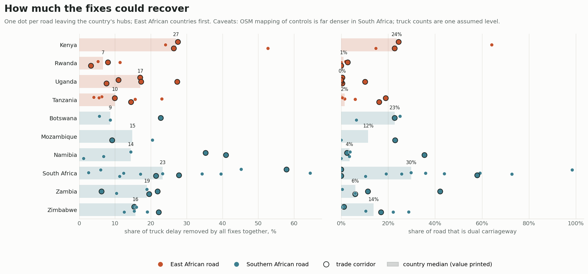{6.3}

## 4.7 Country by country

The regional medians hide distinct national profiles. Each country has twelve figure sheets in the supplementary material (S1); Figure @F15 shows one of them. The figures below are medians over each country's roads, first 200 km.

**Uganda** (5 roads; 35 truck-minutes per 100 km). Uganda has the densest roadsides with Rwanda: 253 buildings within 100 m per km, and 68% of road length in roadside settlement. Roadside activity is the largest single cause (28% of truck delay), followed by hills (23%), assumed humps (17%) and the five weighbridges (10%). Few controls are mapped (2.5 per 100 km). The companion paper treats Uganda in detail.

**Kenya** (4 roads; 38 minutes). Kenya combines dense settlement on the roads to Malaba and Moyale with long open stretches on the road to Mombasa. Weighbridges (22%) are the largest cause, at Mlolongo, Isinya, Webuye, Tallstation and Arorwet, ahead of humps (19%), hills (18%) and roadside activity (13%). The roadside grew 60% in 2000–2020, and Kenya has the highest median exposure per km of any country (1.33). Figure @K1 maps its roads.

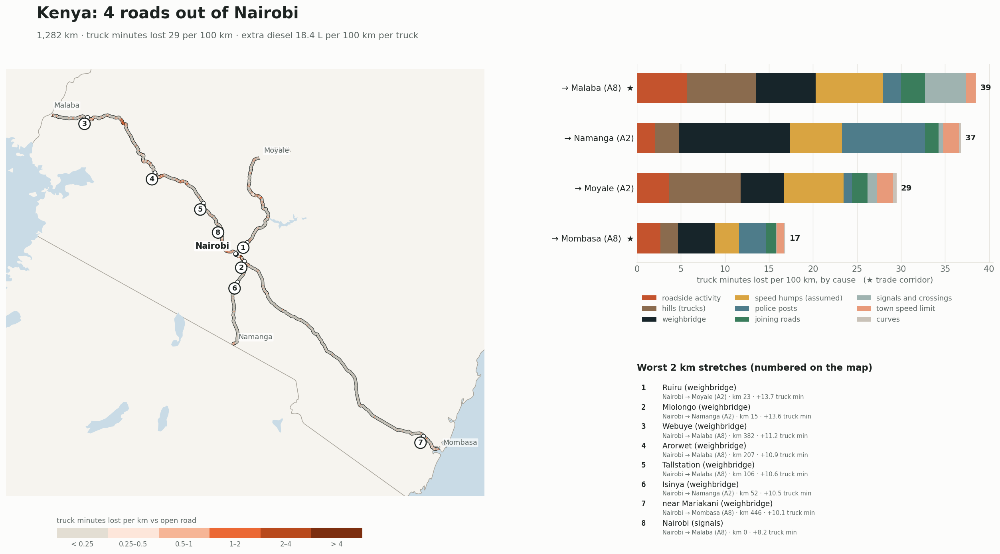{6.0}

**Rwanda** (4 roads; 47 minutes, the highest). Almost the whole of Rwanda's network outside Kigali is roadside settlement: 79% settlement, 254 buildings per km. Its hills add the most time (35%), with roadside activity (24%), humps (15%) and curves (14%). Because a truck held back on a climb burns less fuel against air resistance, Rwanda's extra diesel is modest (6.4 litres per 100 km) despite its high delay.

**Tanzania** (7 roads; 21 minutes). Tanzania is two countries in one. Dar es Salaam's three roads are among the slowest in the study (54 minutes per 100 km, with 28% of length in towns). Dodoma's four lose only 18. Hills (27%), assumed humps (21%), roadside activity (16%) and weighbridges at Vigwaza and Mikese (14%) lead. Tanzania's roadside grew fastest of all, 63% in 2000–2020, while only 0.5 controls per 100 km are mapped. Figure @K2 maps its roads.

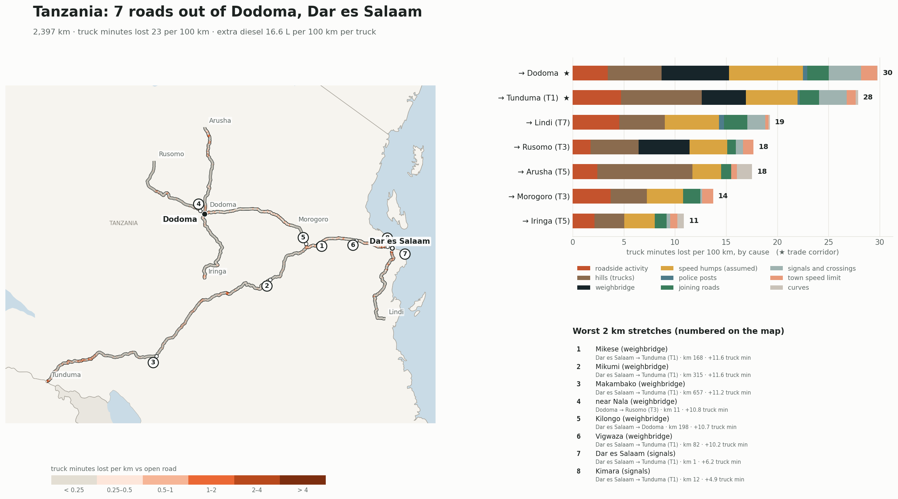{6.0}

**South Africa** (13 roads; 18 minutes). South Africa's two hubs differ. Johannesburg's eight arteries lose 29 minutes per 100 km, mostly at signals and crossings on the West and East Rand; Pretoria's five lose 17. Signals and crossings account for 41% of truck delay and hills for 23%. The roadside is sparse (42 buildings per km) and grew the least (22%). Nearly a third of the length is dual carriageway (median 30%). Figure @K3 maps its roads.

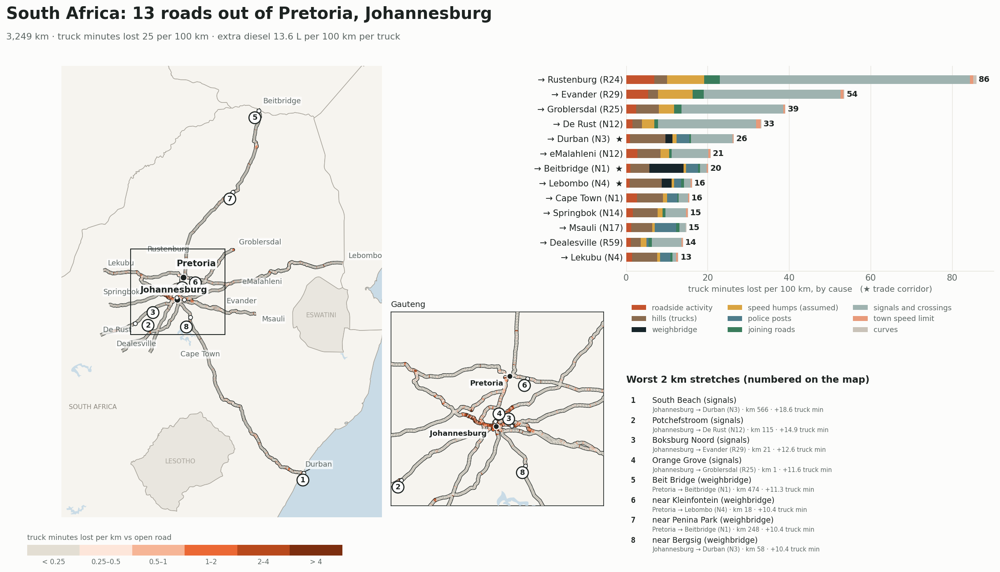{6.0}

**Botswana** (3 roads; 20 minutes). Gaborone's roads are mostly open (67%), but signals and crossings in and around the capital account for 48% of truck delay. Botswana has 17.5 mapped controls per 100 km, the second highest after South Africa.

**Zimbabwe** (6 roads; 12 minutes, the lowest). Harare's roads run through open country for two-thirds of their length. Hills cause 43% of the little delay there is, and police posts (13%) are the second cause. Harare–Beitbridge, the main freight route south, is the fastest trade corridor in the study.

**Zambia** (5 roads; 22 minutes). Lusaka's roads are half settlement (50%), with delay spread across hills (25%), signals (17%), humps (15%), roadside activity (12%), police posts (11%) and joining roads (11%). The short T2 to Chirundu behaves like an East African road (34 minutes per 100 km, 67% settlement or town). The 1,020 km T2 to Nakonde is mostly open.

**Mozambique** (2 roads; 42 minutes). Maputo's two arteries pass through the densest roadside in the South (159 buildings per km). Assumed humps are the largest cause (32%), followed by signals (17%) and roadside activity (15%). They burn the most extra diesel of any country, 19 litres per 100 km.

**Namibia** (5 roads; 15 minutes). Windhoek's roads are 92% open road with 11 buildings per km and the lowest exposure in the study (0.04 per km). What delay there is comes from hills (32%), signals and crossings in Windhoek (31%) and weighbridges (16%), and friction adds only 3 litres of diesel per 100 km.

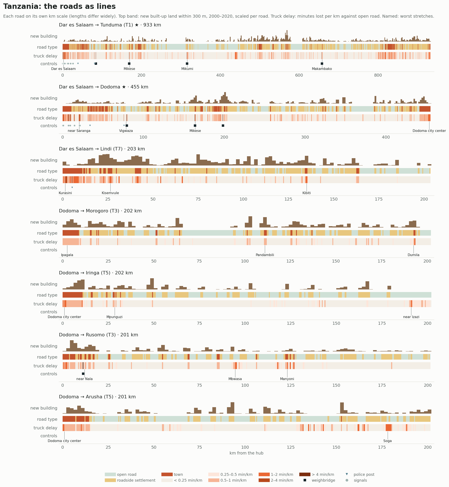{6.0}

# 5. Discussion

## 5.1 Linear towns in the East

The clearest regional difference is in what lines the road, not in the road itself. East African arteries are, for most of their first 200 km, linear towns: about two-thirds settlement or town, 155 buildings per km and over a thousand residents per km within 300 m. Their roadsides are still growing faster than Southern ones. Southern arteries outside the metropolitan regions run mostly through open country. Where a Southern road does run through dense settlement, as from Maputo to the border or from Lusaka to Chirundu, it loses time like an East African one. The difference is therefore one of settlement patterns, rooted in rural population density, land tenure and the history of the roads, more than one of engineering.

The finding adds a dimension to the familiar contrast between East African and Southern African corridor costs. Borders, ports and the trucking market remain the larger costs per trip (Teravaninthorn and Raballand, 2009; NCTTCA, 2026). But the moving part of the trip is also slower in the East, and it burns more fuel. Its share is likely to grow, because the roadside is building up faster there.

## 5.2 Mapping is part of the result

The comparison of controls shows how open data can mislead in comparative work. Taken at face value, Southern African roads are slowed far more by signals and crossings. Part of that is real: Gauteng's arteries are signalised urban roads for tens of kilometres. Part of it reflects how completely South Africa is mapped. The paper therefore separates the causes that come from imagery and elevation (buildings, junctions, terrain) from those that come from mappers (controls). The headline comparison and the strong correlation with buildings rest on the former. A comparison of controls between countries should wait for consistent inventories, or for street-level imagery that detects them the same way everywhere.

## 5.3 Policy

Three implications follow.

First, East African corridor programmes that concentrate on borders and pavements leave the roadside untreated. On the Northern Corridor in particular, the roads to Malaba from both sides now lose 45–58 minutes per 100 km to friction, controls and terrain. That is five to ten times the best Southern trade corridors. Land-use control on new frontage, service roads and stopping bays on the worst stretches, and protected crossings would address the cause rather than the symptom.

Second, the control points remain the cheapest time to recover. Weigh-in-motion where weighbridges stand, and an end to routine police stops, save as much time per trip as long lengths of service road.

Third, Southern Africa's metropolitan arteries, especially in Gauteng, are slow for different reasons, signals and junctions. Freight routing around the metropolitan regions or signal priority on freight routes would help more than roadside measures.

## 5.4 Safety

East African arteries put far more people beside fast trucks. In both regions the settlements between towns, not the towns, carry most of the exposure, because trucks still run at near open-road speed there. Measures that separate through traffic from local life, such as service roads, crossings near schools and bays for stopping vehicles, address safety and friction together. Raising speed through settlements would trade one for the other.

## 5.5 A replicable comparison

The pipeline that produced these results is open and runs from global datasets, and it found the roads itself. It can be extended to other hubs, to West Africa or to later years without new fieldwork. The weakest inputs are local: hump inventories, stop times at police posts and weighbridges, and traffic counts. Supplying any of them for one country would sharpen that country's results without changing the method.

## 5.6 Uganda in regional context

Run with region-wide road types and GHS-POP population, Uganda's five corridors give results close to the companion paper. Kampala–Malaba loses 58 truck-minutes per 100 km here against 55 there, and the ranking of the five roads is unchanged. The regional view adds context: Uganda's roads are not exceptional for East Africa. Rwanda's are denser and slower, and Kenya's road to Malaba and Tanzania's roads from Dar es Salaam lose similar time. What sets Uganda apart is the mix of causes. Roadside activity leads there, while in Kenya it is weighbridges and in Rwanda hills. Fixes that work in Uganda therefore need adjusting before they are copied to its neighbours.

## 5.7 Implications for corridor programmes

Regional corridor programmes, such as the Northern and Central Corridor authorities in the East and the corridor groups of the Southern African Development Community, monitor transit time from port to border with GPS and cargo tracking. These results suggest adding three routine measures:

- the share of each corridor in roadside settlement;
- its rate of roadside building;
- the minutes lost per 100 km to friction and controls.

All three can be computed from global open data every year and compared across countries, and they would show where the moving part of transit time is deteriorating before it shows up in average speeds. The method also offers a common basis for prioritising service roads and crossings across borders, which corridor programmes have so far treated as national matters.

# 6. Limitations

- **The model is calibrated only in Uganda.** Its assumptions (speeds, stop times, friction effects) are the Uganda study's, validated against trip times there. No published trip times were collected elsewhere. Southern African roads with better pavements and driver behaviour may lose less to the same roadside. Toll plazas are not a cause.
- **Mapping of controls is uneven.** OSM maps controls with very uneven completeness, far more densely in South Africa. Comparisons of signals, crossings, police posts and weighbridges between countries are partly comparisons of mapping. Schools, by contrast, are mapped more fully in Uganda.
- **Humps are assumed.** One hump per town piece is assumed everywhere.
- **Truck counts are assumed.** One count is used for every road, so annual costs, fuel and CO₂ are indicative and not compared between roads.
- **Population is GHS-POP 2025** rather than WorldPop; Uganda's numbers here therefore differ slightly from the companion paper's, as do its road types (clustered jointly).
- **Congestion is not modelled**, which understates delay on the metropolitan sections of every hub.
- **Some causes overlap.** The first 200 km of roads leaving the same hub can overlap near the city, so some pieces, people and causes are counted more than once in regional totals. Medians across roads are not affected.

# 7. Conclusion

On 54 roads leaving twelve hubs in East and Southern Africa, the time and fuel lost between the control points follow what lines the road. East African arteries have become linear towns, and they are still building up. A loaded truck loses twice as much time per 100 km there as in Southern Africa, and burns about a third more diesel to friction. East African arteries also place 2.5 times the exposure per km beside fast heavy traffic. Southern African arteries are slowed mainly where they are urban, especially by Gauteng's signals, and run through open country elsewhere. Remedies should follow the cause: the roadside and the control points in the East, and metropolitan junctions and routing in the South. A consistent, open-data method makes these comparisons possible. Its blind spots, chiefly uneven mapping of controls, are themselves worth reporting.

# Supplementary material

The supplementary figures are in the repository under regional-corridors/figures/:

- **S1** (countries/): twelve sheets per country.
- **S2** (compare/): the country comparisons.
- **S3** (by_hub/): every road in its own panel, four sheets per hub.
- **S4** (closeups/): 4 km close-ups of the worst stretches in every country.

# Data and code availability

All code, derived tables and figures are at https://github.com/gavacharles/uganda-trade-corridors (folder regional-corridors).

# References

Arvis, J.-F., Raballand, G., Marteau, J.-F., 2010. The Cost of Being Landlocked: Logistics Costs and Supply Chain Reliability. World Bank, Washington, DC.

Bang, K.-L., 1998. Indonesian highway capacity manual: impact of side friction on speed–flow relationships. In: Proceedings of the Third International Symposium on Highway Capacity, Copenhagen. Danish Road Directorate, pp. 47–70.

Barrington-Leigh, C., Millard-Ball, A., 2017. The world's user-generated road map is more than 80% complete. PLOS ONE 12(8), e0180698.

Barth, M., Boriboonsomsin, K., 2008. Real-world carbon dioxide impacts of traffic congestion. Transportation Research Record 2058, 163–171.

Bennett, C.R., Greenwood, I.D., 2001. Modelling Road User and Environmental Effects in HDM-4. HDM-4 Documentation Volume 7. PIARC, Paris, and World Bank, Washington, DC.

Chiguma, M.L.M., 2007. Analysis of Side Friction Impacts on Urban Roads: Case Study Dar-es-Salaam. PhD thesis, Royal Institute of Technology (KTH), Stockholm.

Demir, E., Bektaş, T., Laporte, G., 2014. A review of recent research on green road freight transportation. European Journal of Operational Research 237(3), 775–793.

Elvik, R., 2009. The Power Model of the Relationship between Speed and Road Safety: Update and New Analyses. TØI Report 1034/2009. Institute of Transport Economics, Oslo.

Foster, V., Briceño-Garmendia, C. (Eds.), 2010. Africa's Infrastructure: A Time for Transformation. World Bank, Washington, DC.

Funk, C., Peterson, P., Landsfeld, M., et al., 2015. The climate hazards infrared precipitation with stations—a new environmental record for monitoring extremes. Scientific Data 2, 150066.

Gava, C., 2026. Highways that became high streets: roadside settlement, controls and the cost of delay on Uganda's five trade corridors. Working paper.

Haklay, M., 2010. How good is volunteered geographical information? A comparative study of OpenStreetMap and Ordnance Survey datasets. Environment and Planning B: Planning and Design 37(4), 682–703.

Jaramillo, P., Kahn Ribeiro, S., Newman, P., et al., 2022. Transport. In: Climate Change 2022: Mitigation of Climate Change. Contribution of Working Group III to the Sixth Assessment Report of the IPCC. Cambridge University Press, Cambridge.

Jedwab, R., Storeygard, A., 2022. The average and heterogeneous effects of transportation investments: evidence from sub-Saharan Africa 1960–2010. Journal of the European Economic Association 20(1), 1–38.

NCTTCA, 2026. Northern Corridor Transport Observatory Report, 21st edition. Northern Corridor Transit and Transport Coordination Authority, Mombasa.

Nilsson, G., 2004. Traffic Safety Dimensions and the Power Model to Describe the Effect of Speed on Safety. Bulletin 221, Lund Institute of Technology, Lund.

Pal, S., Roy, S.K., 2016. Impact of roadside friction on travel speed and LOS of rural highways in India. Transportation in Developing Economies 2, 9.

Pesaresi, M., Politis, P., 2023. GHS-BUILT-S R2023A: GHS built-up surface grid, derived from Sentinel-2 composite and Landsat, multitemporal (1975–2030). European Commission, Joint Research Centre.

Schiavina, M., Freire, S., Carioli, A., MacManus, K., 2023. GHS-POP R2023A: GHS population grid multitemporal (1975–2030). European Commission, Joint Research Centre.

Sirko, W., Kashubin, S., Ritter, M., et al., 2021. Continental-scale building detection from high resolution satellite imagery. arXiv:2107.12283.

Storeygard, A., 2016. Farther on down the road: transport costs, trade and urban growth in sub-Saharan Africa. Review of Economic Studies 83(3), 1263–1295.

Teravaninthorn, S., Raballand, G., 2009. Transport Prices and Costs in Africa: A Review of the International Corridors. World Bank, Washington, DC.

TRB, 2016. Highway Capacity Manual, 6th edition. Transportation Research Board, Washington, DC.

WHO, 2023. Global Status Report on Road Safety 2023. World Health Organization, Geneva.
